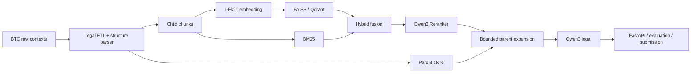

# HCMUTE-SHIPCODE — UDSC 2026

Hệ thống RAG pháp luật tiếng Việt cho hai tác vụ **LegalIR** và **LegalQA** của
UIT Data Science Challenge 2026. Repository bao gồm pipeline chuẩn hóa dữ liệu,
parent–child chunking, dense/BM25/hybrid retrieval, cross-encoder reranking,
sinh câu trả lời bằng LLM local, đánh giá và đóng gói submission.

- **LegalIR:** truy hồi danh sách `document_id`; đánh giá macro Recall và macro
  Precision, hỗ trợ nhiều gold document cho một câu hỏi.
- **LegalQA:** sinh câu trả lời dựa trên context đã truy hồi; đánh giá METEOR và
  ROUGE-L, đồng thời giữ thông tin citation để kiểm tra.

## Trạng thái hiện tại

- Corpus xử lý chính: `data/processed_v3`; dữ liệu nguồn nằm tại `data/raw/`.
- Toàn bộ model runtime được tải local, không gọi API model thương mại.
- Retrieval giữ `parent_id`; QA chỉ mở rộng parent trong giới hạn sau khi rerank.
- Workflow A của Task1 đã đóng; Workflow B TV2 đang ở bước audit B2a-0 về
  provenance và tài liệu dài.
- Các báo cáo, manifest và progress log trong `reports/task1/` là nguồn kiểm tra
  trạng thái có thẩm quyền; tên file trong `artifacts/` không tự quyết định
  production.

## Mô hình chính thức

| Vai trò | Checkpoint | Local path | Công dụng |
| --- | --- | --- | --- |
| Embedding | [`huyydangg/DEk21_hcmute_embedding_v2`](https://huggingface.co/huyydangg/DEk21_hcmute_embedding_v2) | `models/dek21-v2` | Vector hóa query và chunk |
| Reranker | [`Qwen/Qwen3-Reranker-0.6B`](https://huggingface.co/Qwen/Qwen3-Reranker-0.6B) | `models/reranker` | Chấm điểm mức liên quan của cặp query–document |
| LLM | [`thangvip/qwen3-1.7b-vietnamese-legal-grpo-phase-2`](https://huggingface.co/thangvip/qwen3-1.7b-vietnamese-legal-grpo-phase-2) | `models/qwen3-legal` | Sinh câu trả lời pháp luật có citation |

Task1 hiện dùng HCMUTE embedding và Qwen3 Reranker theo manifest local. Revision
đã resolve của từng model được ghi trong `models/download_manifest.json`; không
nên thay model chỉ dựa trên tên thư mục. Xem thêm [Model Registry](docs/models/model_registry.md).

Tải đúng model production Task1:

```powershell
python download_models.py --profile task1
```

## Kiến trúc



Luồng chuẩn là **retrieve children → rerank → mở rộng parent có giới hạn →
LLM**. Không thay child bằng nguyên parent trước rerank.

## Corpus `processed_v3`

| Hạng mục | Giá trị đã audit |
| --- | ---: |
| Documents | 8.532 |
| Chunks | 1.270.356 |
| Parents | 184.548 |
| Synthetic benchmark nội bộ | 100 câu, 7 loại câu hỏi |
| Dung lượng | 2.905.166.051 bytes (2,706 GiB) |
| Missing source token / bigram | 0 / 0 |
| Duplicate / orphan / invalid / empty chunk | 0 |
| Oversized chunk / missing metadata | 0 / 0 |

Hash chuẩn:

```text
processed_corpus_tree_hash: 80fb33ff1133ce2583097cc5a98ddc9739240a60bfe11c979892d5412dcda647
benchmark_sha256:           80f27b47e81aa40b25ca55ab2fe7fb7edd8fc65388f41fdae841a48a104892d3
source_chunk_corpus_sha256: d2aa542f1f45ad9f310bceb43063aed3058d2e81edbb15ecf18525c3c6d6bbc7
```

Corpus có `integrity_gate_passed=true`. Báo cáo semantic vẫn ghi nhận 20 context
chính thức có `passage` rỗng ngay từ nguồn BTC; hệ thống giữ placeholder và cảnh
báo, không tự tạo nội dung. Chi tiết nằm trong:

- `data/processed_v3/metadata/processing_manifest.json`;
- `data/processed_v3/metadata/disk_audit_report.json`;
- `data/processed_v3/metadata/validation_report.json`.

Có 1.359 document được gắn cờ review cấu trúc nhưng nội dung vẫn được giữ bằng
structured/partial/fallback chunks; đây không phải số document bị loại. Benchmark
100 câu là bộ synthetic dùng để smoke và so sánh nội bộ, không phải test chính
thức. Chỉ kết luận reranker cải thiện sau khi máy GPU tạo `comparison.md`.

Dữ liệu lớn không nằm trong Git. Khi chuyển sang máy khác, copy nguyên cả năm
thư mục `documents`, `chunks`, `parents`, `benchmarks`, `metadata` bên trong
`data/processed_v3`; không trộn với corpus cũ. Xem [Data README](data/README.md).

## Bắt đầu nhanh

Khuyến nghị Python 3.11. Với PowerShell trên Windows:

```powershell
git clone https://github.com/solvarhuynh/UIT-Data-Science-Challenge-2026.git
cd UIT-Data-Science-Challenge-2026
py -3.11 -m venv .venv
Set-ExecutionPolicy -Scope Process Bypass
.\.venv\Scripts\Activate.ps1
python -m pip install --upgrade pip
python -m pip install -c requirements_runtime.txt -e ".[llm,rerank,retrieval,models]"
python -m pip install -r requirements_dev.txt
$env:PYTHONPATH = "$PWD\src"
```

Tải model nếu cần chạy local:

```powershell
python download_models.py
```

Các lệnh kiểm tra nhỏ và test tự động có thể chạy ngay sau khi cài dependency.
Các file lớn trong `data/`, `artifacts/` và trọng số trong `models/` thường được
quản lý ngoài Git; hãy đọc manifest trước khi sao chép hoặc xóa.

## Chạy từng thành phần

### Index dense/FAISS

```powershell
python scripts/data_prep/index_chunks.py `
  --chunks-dir data/processed_v3/chunks `
  --config-env gpu `
  --vector-db-type faiss `
  --skip-bm25 `
  --force
```

### Sinh candidate và benchmark reranker

```powershell
python scripts/evaluation/generate_dense_candidates.py `
  --benchmark data/processed_v3/benchmarks/synthetic_qa.jsonl `
  --config-env gpu `
  --candidate-k 50 `
  --output artifacts/tv2/dense_predictions.jsonl `
  --manifest artifacts/tv2/dense_run_manifest.json

python scripts/evaluation/benchmark_reranker.py `
  --benchmark data/processed_v3/benchmarks/synthetic_qa.jsonl `
  --candidates artifacts/tv2/dense_predictions.jsonl `
  --model models/reranker `
  --device cpu `
  --batch-size 8 `
  --max-length 1024 `
  --candidate-k 50 `
  --top-n 5 `
  --output-dir artifacts/task1/reranker-evaluation
```

Kết quả được ghi tại thư mục output do lệnh chỉ định; hãy lưu kèm manifest model
và corpus để có thể tái lập.

### Backend và dịch vụ phụ trợ

```powershell
docker compose up -d qdrant redis
uvicorn udsc2026.api.app:app --reload
```

Endpoint kiểm tra:

```text
GET  /health
GET  /ready
POST /api/v1/query
```

Hoặc build toàn bộ backend bằng Docker:

```powershell
docker compose up -d --build
```

### Frontend

Yêu cầu Node.js `^20.19.0` hoặc `>=22.12.0`.

```powershell
cd "frontend/giao dien"
npm install
npm run dev
```

Frontend phục vụ demo; không nằm trên đường chấm điểm chính.

## Kiểm tra chất lượng

```powershell
python -m pytest -v --basetemp .pytest_runtime -p no:cacheprovider
python -m ruff check src tests scripts
python -m mypy src scripts
```

Các kiểm tra trọng yếu gồm schema/contract, ingestion zero-loss, cache/index
versioning, parent expansion, reranker, metric LegalIR/LegalQA, API và submission.

## Cấu trúc repository

```text
.
├── configs/                         Cấu hình base, development và GPU
├── data/                            Raw/processed/index local; file lớn không commit
│   └── processed_v3/                Corpus chính thức đã audit
├── docs/
│   ├── members/                     Kế hoạch, setup và runbook của TV1–TV5
│   ├── models/                      Registry và ghi chú model
│   └── project/                     Thiết kế hệ thống, API, data pipeline, Git workflow
├── experiments/                     Thử nghiệm tách theo thành viên
├── frontend/                        Web UI demo
├── models/                          Model local; không commit weight lớn
├── outputs/                         Log chạy local/GPU
├── prompts/                         System prompt và RAG template có version
├── scripts/
│   ├── beam/                        Runner và thí nghiệm Task1 trên Beam
│   │   ├── task1_v2/                Module V2 score-first reranker
│   │   ├── task1_v3_residual/       Module V3 residual policy/ranking
│   │   │   ├── common.py            Helper chung và đường dẫn artifact V3
│   │   │   ├── train_residual_policy.py
│   │   │   ├── train_residual_policy_v3b.py
│   │   │   ├── forensic_benefit_neutral_signal.py
│   │   │   └── train_delta_recall_residual.py
│   │   ├── beam_task1_v1a_real.py
│   │   ├── beam_task1_v1a_eval_only.py
│   │   ├── beam_task1_v2_prepare_cpu.py
│   │   ├── beam_task1_v2_fold0.py
│   │   ├── beam_task1_v3_prepare_cpu.py
│   │   ├── beam_task1_v3_policy_cpu.py
│   │   ├── beam_task1_v3b_policy_cpu.py
│   │   ├── beam_task1_v3b_fold0_eval_cpu.py
│   │   └── beam_task1_delta_recall_residual_cpu.py
│   ├── ci_cd/                       Script CI/CD
│   ├── data_prep/                   Ingestion và indexing
│   ├── evaluation/                  Candidate generation, metric và reranker benchmark
│   ├── gpu/                         Preflight và pipeline RTX
│   ├── submission/                  Writer/validator submission LegalIR và LegalQA
│   ├── task1/                       Script Task1 tiện ích/đóng gói
│   └── training/                    Fine-tune/training script
├── src/udsc2026/                    Mã nguồn production
└── tests/                           Unit và integration tests
```

## Phân công

| Thành viên | Phạm vi chính |
| --- | --- |
| TV1 | FastAPI, orchestration, cache, logging và integration |
| TV2 | Embedding, dense/BM25 retrieval, FAISS/Qdrant và hybrid fusion |
| TV3 | Qwen3, QA engine, prompt, citation và anti-hallucination |
| TV4 | ETL, legal parser, parent–child chunking và benchmark data |
| TV5 | Reranking, evaluation, GPU/MLOps, submission và UI demo |

## Tài liệu chính

- [System Design](docs/project/10_system_design.md)
- [Data Pipeline](docs/project/11_data_pipeline.md)
- [API Contract](docs/project/api_contract.md)
- [Git Workflow](docs/project/git_workflow.md)
- [Docker Deployment](docs/project/12_docker_deployment.md)
- [TV1](docs/members/tv1/tv1.md)
- [TV2 Setup](docs/members/tv2/tv2_setup.md)
- [TV3 Setup](docs/members/tv3/tv3_setup.md)
- [TV4 Setup](docs/members/tv4/tv4_setup.md)
- [TV5 Setup](docs/members/tv5/tv5_setup.md)
- [Prompt Registry](prompts/README.md)

## Quy tắc làm việc

- Không commit raw data, processed corpus, vector store, model weights hoặc cache.
- Không đổi model/corpus chính thức mà không cập nhật manifest và benchmark.
- Không tái sử dụng index/candidate khi corpus hash hoặc model revision thay đổi.
- Mọi thay đổi contract phải kèm test và cập nhật tài liệu liên quan.
- Không force-push nhánh thành viên; hợp nhất bằng merge/fast-forward có kiểm tra.

## Cập nhật Task1 trên nhánh TV2

Các nhóm công việc đã hoàn tất và được commit trên `tv2` gồm: tái tổ chức tài liệu
Task1/Workflow A/B; khóa downloader và provenance cho Qwen3-Reranker; các audit
B2a-0 (context, GPU gate và long-document root cause); artifact Workflow A/B;
progress log; cùng tooling đóng gói submission. Các kết quả vẫn giữ nguyên
điều kiện không dùng Fold0/public labels cho các audit tương ứng.

### Phục hồi các output lớn ngoài Git

GitHub giới hạn file 100 MB, vì vậy các output lớn được gom vào
`task1_large_outputs.zip` ở thư mục gốc và thư mục giải nén cục bộ
`artifacts/task1/large_outputs/` (đã được `.gitignore`). ZIP chứa các file với
tên gốc; cần đặt từng file về đúng đường dẫn sau trước khi chạy lại công cụ:

```text
step2p4_proxy_predictions.jsonl       -> reports/task1/workflow_a/
step2p5_fused_scores.jsonl            -> reports/task1/workflow_a/
step2p5_p1_inner_full_action_scores.jsonl -> reports/task1/workflow_a/
step2p1f_full_action_scores.jsonl     -> reports/task1/workflow_a/
step2p1a_median_scores.jsonl           -> reports/task1/workflow_a/
step2f2_full_action_scores.jsonl       -> reports/task1/workflow_a/
step2p4_proxy_inner_oof_predictions.jsonl -> reports/task1/workflow_a/
f1_actions.npz ... f4_actions.npz     -> reports/task1/workflow_b/tv4/b1/recovery/workflow_b_b1_recovery/
```

Sau khi giải nén, kiểm tra `artifacts/task1/large_outputs/MANIFEST.txt` để đối
chiếu kích thước và SHA256. Không commit thư mục output hoặc file ZIP này.
