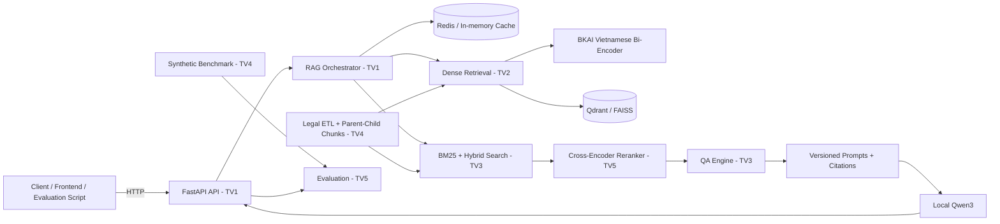

# UDSC2026 - LegalIR & LegalQA

Hệ thống RAG pháp luật Việt Nam cho DSC2026, tập trung vào backend: xử lý dữ liệu pháp luật, truy hồi dense/sparse/hybrid, reranking, sinh câu trả lời bằng LLM local, citation chính xác, benchmark và đóng gói submission.

Mảng Web Frontend nằm trong `frontend/` và do nhân sự riêng phụ trách. Nhóm TV1-TV5 tập trung vào kiến trúc xử lý dữ liệu, truy hồi và mô hình AI.

## Introduction

Hai mô hình local chính:

- Embedder: `bkai-foundation-models/vietnamese-bi-encoder` cho dense retrieval tiếng Việt.
- LLM: Qwen3 legal local checkpoint trong `models/qwen3-legal/` cho sinh câu trả lời pháp lý.

Không yêu cầu dịch vụ LLM bên ngoài trong baseline.

## Competition Tasks

- LegalIR: parse dữ liệu pháp luật, lập chỉ mục, truy hồi và xếp hạng đoạn văn bản pháp luật.
- LegalQA: sinh câu trả lời dựa trên context truy hồi, kèm citation và kiểm soát hallucination.
- Evaluation: đo MRR, Recall@K, ROUGE-L, latency, citation correctness và sinh file `submission.csv`.

## Architecture



## Hướng dẫn khởi chạy

### Prerequisites

- Python 3.10+
- Git
- Docker nếu chạy VectorDB/Redis bằng compose
- Node.js 18+ chỉ cần khi làm việc với `frontend/`

### Bước 1: Khởi tạo môi trường và tải models

```powershell
python -m venv .venv
.\.venv\Scripts\Activate.ps1
pip install -e .
pip install huggingface_hub
python .\download_models.py
```

`download_models.py` tải hai model local vào:

```text
models/bkai-bi-encoder/
models/qwen3-legal/
```

### Bước 2: Chạy backend FastAPI

```powershell
uvicorn udsc2026.api.app:app --reload
```

Backend mặc định chạy tại `http://127.0.0.1:8000`.

### Bước 3: Chạy stack phụ trợ nếu cần

```powershell
docker compose up -d
```

Stack local có thể gồm VectorDB, Redis cache và backend tùy cấu hình trong `docker-compose.yml`.

### Bước 4: Chạy thử nghiệm theo thành viên

```powershell
cd experiments\tvX
python .\scripts\<ten_script_thu_nghiem>.py
```

Thay `tvX` bằng `tv1`, `tv2`, `tv3`, `tv4` hoặc `tv5`. Logic thử nghiệm chỉ đưa vào `src/udsc2026/` sau khi interface đã rõ và có test.

## Repository Structure

```text
udsc2026/
├── configs/                         # YAML/env config cho runtime, model, retrieval, cache
├── data/
│   ├── raw/                         # Dữ liệu gốc từ BTC, không commit file lớn
│   ├── processed/                   # Output ETL: chunks, parents, metadata, benchmark
│   │   ├── chunks/                  # LegalChunk JSONL cho TV2 index
│   │   ├── documents/               # Document/parent context sau khi chuẩn hóa
│   │   └── metadata/                # Validation report, corpus stats, data quality report
│   └── vector_store/                # Qdrant/FAISS/BM25 index local, không commit file lớn
├── docker/                          # Dockerfile, compose override và cấu hình container
├── docs/
│   ├── algorithms/                  # Hybrid Search, reranking, retrieval strategy
│   ├── architecture/                # FastAPI, data pipeline, system rules
│   ├── member/                      # Phân công chi tiết cho TV1-TV5
│   │   ├── tv1.md                   # Integration & Orchestration
│   │   ├── tv2.md                   # Dense Retrieval
│   │   ├── tv3.md                   # QA, LLM, BM25, Hybrid Search
│   │   ├── tv4.md                   # ETL, Parent-Child Chunking, Synthetic Benchmark
│   │   └── tv5.md                   # Reranking, Evaluation, MLOps
│   ├── models/                      # Model registry, embedding, LLM optimization
│   └── project/                     # Git workflow, coding convention, API contract
├── experiments/
│   ├── tv1/                         # Thử nghiệm orchestration, API, cache, logging
│   ├── tv2/                         # Thử nghiệm BKAI embedding, VectorDB, dense search
│   ├── tv3/                         # Thử nghiệm Qwen3, prompt, BM25, hybrid fusion
│   ├── tv4/                         # Thử nghiệm ETL, parser, chunking, synthetic Q&A
│   └── tv5/                         # Thử nghiệm rerank, evaluation, Docker, submission
├── frontend/                        # Web frontend do nhân sự riêng phụ trách
├── models/
│   ├── bkai-bi-encoder/             # Local embedder
│   └── qwen3-legal/                 # Local generator
├── prompts/
│   ├── README.md                    # Prompt registry
│   ├── rag_templates/               # RAG prompt templates có version
│   └── system/                      # Versioned system prompts
├── scripts/                         # Setup, indexing, evaluation, submission, utilities
├── src/
│   └── udsc2026/
│       ├── api/                     # TV1: FastAPI app, routes, DI, health/readiness
│       ├── contracts/               # Pydantic schemas dùng chung
│       ├── evaluation/              # TV5: metrics, reports, submission writer
│       ├── infrastructure/
│       │   ├── embedding/           # TV2: BKAI EmbeddingClient
│       │   ├── llm/                 # TV3: Qwen3 transformers/vLLM client
│       │   ├── persistence/         # Shared storage/cache/log helpers nếu cần
│       │   ├── reranker/            # TV5: Cross-Encoder client
│       │   └── vector_db/           # TV2: Qdrant/FAISS adapters
│       ├── ingestion/               # TV4: readers, cleaners, parser, chunking
│       ├── qa/                      # TV3: Prompt builder, QAEngine, citation parser
│       └── retrieval/
│           ├── dense/               # TV2: DenseRetriever
│           ├── sparse/              # TV3: BM25 sparse retrieval
│           ├── hybrid/              # TV3: score fusion
│           └── reranking/           # TV5: CrossEncoderReranker
├── tests/                           # Unit/integration tests
├── docker-compose.yml
├── pyproject.toml
└── README.md
```

## Team Ownership

- TV1: Integration & Orchestration, FastAPI, Dependency Injection, async handling, cache, logging, latency.
- TV2: Dense Retrieval, BKAI bi-encoder, query/document embedding, Qdrant/FAISS, vector upsert/search.
- TV3: QA Engine, Qwen3, prompt versioning, citation anti-hallucination, BM25, Hybrid Search.
- TV4: Advanced ETL, legal structure parser, Unicode cleanup, Parent-Child Chunking, synthetic benchmark Q&A.
- TV5: Cross-Encoder Reranking, MRR/Recall@K/ROUGE-L, Docker multi-stage, CodaLab `submission.csv`.

## Documents

- [Repository Structure](docs/khung_repo.md)
- [System Design](docs/project/10_system_design.md)
- [API Contract](docs/project/api_contract.md)
- [Git Workflow](docs/project/04_git_workflow.md)
- [TV1 Work Plan](docs/member/tv1.md)
- [TV2 Work Plan](docs/member/tv2.md)
- [TV3 Work Plan](docs/member/tv3.md)
- [TV4 Work Plan](docs/member/tv4.md)
- [TV5 Work Plan](docs/member/tv5.md)
- [Prompt Registry](prompts/README.md)
- [Test Cases Reference](tests/test_cases_reference.md)

## Development Workflow

Mỗi thành viên dùng branch/worktree riêng, thử nghiệm trong `experiments/tvN/`, sau đó chỉ đưa mã ổn định vào `src/`. Contract giữa các pipeline phải được cập nhật trước khi thay đổi API hoặc output chunk. Mọi PR cần test tương ứng và không commit model weights, dữ liệu raw, vector database lớn hoặc cache.

## Roadmap

1. Hoàn thiện ETL, legal parser, parent-child chunking và synthetic benchmark.
2. Index dữ liệu bằng BKAI bi-encoder và VectorDB.
3. Tích hợp BM25, Hybrid Search và Cross-Encoder reranking.
4. Tích hợp Qwen3 local với prompt versioning và citation kiểm soát hallucination.
5. Đánh giá LegalIR/LegalQA, tối ưu latency, Docker hóa và chuẩn bị `submission.csv`.
