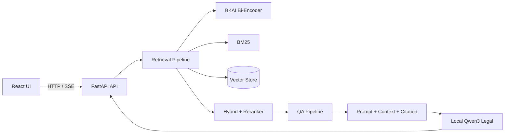

# UDSC2026 — LegalIR & LegalQA

Hệ thống RAG pháp luật Việt Nam, với React ở frontend và FastAPI ở backend. Hệ thống hỗ trợ tìm kiếm điều luật, hỏi–đáp có ngữ cảnh, streaming và citation.

## Introduction

Hai mô hình local được sử dụng:

- Embedder: `bkai-foundation-models/vietnamese-bi-encoder` cho dense retrieval tiếng Việt.
- LLM: `thangvip/qwen3-1.7b-vietnamese-legal-grpo-phase-2` cho sinh câu trả lời pháp lý.

Không yêu cầu dịch vụ LLM bên ngoài.

## Competition Tasks

- LegalIR: lập chỉ mục, truy hồi và xếp hạng các đoạn văn bản pháp luật.
- LegalQA: sinh câu trả lời dựa trên context truy hồi, kèm citation và kiểm soát hallucination.
- Đánh giá: retrieval metrics, answer quality, citation correctness và sinh file submission.

## Architecture



## Hướng Dẫn Khởi Chạy Dự Án (Quick Start & Running Guide)

### Prerequisites

- Python 3.10+
- Node.js 18+
- Git

### Bước 1: Khởi tạo môi trường & tải models

```powershell
python -m venv .venv
.\.venv\Scripts\Activate.ps1
pip install -e .
pip install huggingface_hub
python .\download_models.py
```

`download_models.py` tải tự động hai model local vào `./models/`:

```text
./models/bkai-bi-encoder/
./models/qwen3-legal/
```

### Bước 2: Khởi chạy Backend FastAPI

Backend chạy tại cổng `8000`:

```powershell
uvicorn udsc2026.api.app:app --reload
```

### Bước 3: Khởi chạy Frontend React

Frontend chạy tại cổng `5173`:

```powershell
cd frontend
npm install
npm run dev
```

### Bước 4: Chạy thử nghiệm cá nhân

Mỗi thành viên chạy notebook hoặc script riêng trong workspace của mình:

```powershell
cd experiments\tvX
python .\scripts\<ten_script_thu_nghiem>.py
```

Thay `tvX` bằng `tv1`, `tv2`, `tv3`, `tv4` hoặc `tv5`. Logic thử nghiệm chỉ được đưa vào `src/udsc2026/` sau khi đã ổn định và có interface rõ ràng.

## Repository Structure

```text
src/udsc2026/
├── api/             # FastAPI routes, streaming response
├── contracts/       # Pydantic request/response schemas
├── ingestion/       # Đọc, làm sạch, cấu trúc và chunking dữ liệu luật
├── retrieval/       # BKAI dense, BM25, hybrid và reranking
├── qa/              # Qwen3, prompt, citation và answer generation
├── infrastructure/  # Adapter model local, vector store và persistence
└── evaluation/      # Batch evaluation và submission
configs/             # Cấu hình theo môi trường
data/                # raw, processed và vector store local
experiments/         # Không gian thử nghiệm tv1–tv5
frontend/            # React application
tests/               # Unit và integration tests
```

## Development Workflow

Mỗi thành viên dùng một Git Worktree/branch riêng, thử nghiệm trong `experiments/tvN/`, sau đó chỉ đưa mã ổn định vào `src/`. Contract giữa các pipeline phải được cập nhật trước khi thay đổi API. Mọi pull request cần test tương ứng và không commit model weights, dữ liệu raw hoặc vector database lớn.

## Documents

- [System Design](docs/project/10_system_design.md)
- [TV1 Work Plan](docs/member/tv1.md)
- [TV2 Work Plan](docs/member/tv2.md)
- [TV3 Work Plan](docs/member/tv3.md)
- [TV4 Work Plan](docs/member/tv4.md)
- [TV5 Work Plan](docs/member/tv5.md)
- [Prompt Registry](prompts/README.md)
- [Test Cases Reference](tests/test_cases_reference.md)

## Experiments

Notebook và script thử nghiệm được cô lập tại `experiments/tv1/` đến `experiments/tv5/`. Kết quả benchmark nên lưu metadata, config và metric; không đưa logic thử nghiệm chưa ổn định vào production package.

## Team

- TV1: Integration & Orchestration, E2E Pipeline, Caching, Logging, Performance Tuning.
- TV2: Dense Retrieval với BKAI Bi-encoder và VectorDB; bổ sung React basic UI.
- TV3: Local Qwen3, prompt system, citation và chống hallucination; bổ sung BM25 + Hybrid Search.
- TV4: Data ETL, legal structure parsing và chunking; bổ sung UI/UX citation + markdown.
- TV5: Cross-Encoder Reranking; bổ sung Docker packaging và CodaLab submission.

## Roadmap

1. Hoàn thiện ingestion và vector index baseline.
2. Tích hợp BKAI + BM25 hybrid retrieval.
3. Tích hợp Qwen3 local với streaming và citation.
4. Đánh giá LegalIR/LegalQA và tối ưu latency.
5. Đóng gói Docker, kiểm thử end-to-end và chuẩn bị submission.
