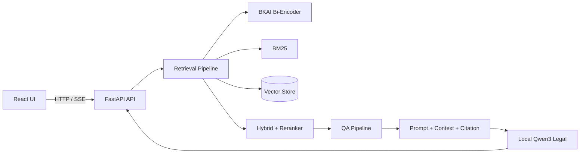

# DSC2026 — LegalIR & LegalQA

Hệ thống RAG pháp luật Việt Nam xây dựng trên core `Vietnamese-Legal-Chatbot-RAG-System`, với React ở frontend và FastAPI ở backend. Hệ thống hỗ trợ tìm kiếm điều luật, hỏi–đáp có ngữ cảnh, streaming và citation.

## Introduction

Hai mô hình local được sử dụng:

- Embedder: `bkai-foundation-models/vietnamese-bi-encoder` cho dense retrieval tiếng Việt.
- LLM: `thangvip/qwen3-1.7b-vietnamese-legal-grpo-phase-2` cho sinh câu trả lời pháp lý.

Không yêu cầu OpenAI API hoặc dịch vụ LLM bên ngoài.

## Competition Tasks

- LegalIR: lập chỉ mục, truy hồi và xếp hạng các đoạn văn bản pháp luật.
- LegalQA: sinh câu trả lời dựa trên context truy hồi, kèm citation và kiểm soát hallucination.
- Đánh giá: retrieval metrics, answer quality, citation correctness và sinh file submission.

## Architecture



## Quick Start

```powershell
python -m venv .venv
.\.venv\Scripts\Activate.ps1
pip install -e .
pip install huggingface_hub
python .\download_models.py
uvicorn dsc2026_legal.api.main:app --host 0.0.0.0 --port 8000 --reload
```

`download_models.py` tải tự động hai model vào:

```text
./models/bkai-bi-encoder/
./models/qwen3-legal/
```

Chạy frontend React trong thư mục `frontend/` bằng lệnh của package manager tương ứng, thường là `npm install` và `npm run dev`.

## Repository Structure

```text
src/dsc2026_legal/
├── api/             # FastAPI routes, streaming response
├── contracts/       # Pydantic request/response schemas
├── ingestion/       # Đọc, làm sạch, cấu trúc và chunking dữ liệu luật
├── retrieval/       # BKAI dense, BM25, hybrid và reranking
├── qa/              # Qwen3, prompt, citation và answer generation
├── infrastructure/  # Adapter model local, vector store và persistence
└── evaluation/      # Batch evaluation và submission
configs/             # Cấu hình theo môi trường
data/                # raw, processed và vector store local
experiments/         # Không gian thử nghiệm tv1–tv5
frontend/            # React application
tests/               # Unit và integration tests
```

## Development Workflow

Mỗi thành viên dùng một Git Worktree/branch riêng, thử nghiệm trong `experiments/tvN/`, sau đó chỉ đưa mã ổn định vào `src/`. Contract giữa các pipeline phải được cập nhật trước khi thay đổi API. Mọi pull request cần test tương ứng và không commit model weights, dữ liệu raw hoặc vector database lớn.

## Documents

- [System Design](docs/10_system_design.md)
- [Prompt Registry](prompts/README.md)
- [Test Documentation](docs/test.md)

## Experiments

Notebook và script thử nghiệm được cô lập tại `experiments/tv1/` đến `experiments/tv5/`. Kết quả benchmark nên lưu metadata, config và metric; không đưa logic thử nghiệm chưa ổn định vào production package.

## Team

- TV1: Platform, FastAPI và React integration.
- TV2: Sparse retrieval và BM25.
- TV3: QA, prompt, Qwen3 và citation.
- TV4: Ingestion, legal structure và chunking.
- TV5: BKAI dense retrieval, hybrid search và evaluation.

## Roadmap

1. Hoàn thiện ingestion và vector index baseline.
2. Tích hợp BKAI + BM25 hybrid retrieval.
3. Tích hợp Qwen3 local với streaming và citation.
4. Đánh giá LegalIR/LegalQA và tối ưu latency.
5. Đóng gói Docker, kiểm thử end-to-end và chuẩn bị submission.

