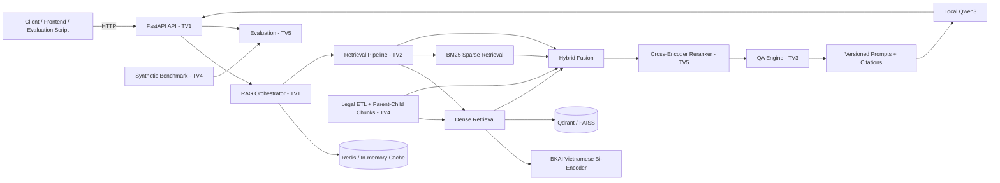

# HCMUTE-SHIPCODE - UDSC2026

 **LegalIR & LegalQA**: Hệ thống RAG pháp luật Việt Nam cho DSC2026, xử lý dữ liệu pháp luật, truy hồi dense/sparse/hybrid, reranking, sinh câu trả lời bằng LLM local, citation chính xác, benchmark và đóng gói submission.

## Introduction

Hai mô hình local chính:

- Embedder: `bkai-foundation-models/vietnamese-bi-encoder` cho dense retrieval tiếng Việt.
- LLM: Qwen3 legal local checkpoint trong `models/qwen3-legal/` cho sinh câu trả lời pháp lý.

Không yêu cầu dịch vụ LLM bên ngoài trong baseline.

## Competition Tasks

- LegalIR: parse dữ liệu pháp luật, lập chỉ mục, truy hồi và xếp hạng đoạn văn bản pháp luật.
- LegalQA: sinh câu trả lời dựa trên context truy hồi, kèm citation và kiểm soát hallucination.
- Evaluation: đo MRR, Recall@K, ROUGE-L, latency, citation correctness và sinh file `submission.csv`.

## Architecture



## Hướng dẫn khởi chạy

### Chạy toàn bộ project

Yêu cầu: Python 3.10–3.12, Docker và Node.js nếu chạy frontend.

```powershell
python -m venv .venv
.\.venv\Scripts\Activate.ps1
python -m pip install --upgrade pip
python -m pip install -r requirements_runtime.txt
python -m pip install -r requirements_dev.txt
python -m pip install -e ".[llm,rerank,retrieval]"
$env:PYTHONPATH = "$PWD\src"
python download_models.py
docker compose up -d
```

Index dữ liệu và chạy toàn bộ test:

```powershell
python scripts/index_chunks.py --chunks-dir data/processed/chunks --vector-db-type faiss
python -m pytest -v --basetemp .pytest_tmp -p no:cacheprovider
```

Chạy backend:

```powershell
uvicorn udsc2026.api.app:app --reload
```

Chạy frontend ở terminal khác:

```powershell
cd "frontend/giao dien"
npm install
npm run dev
```

Model được tải vào:

```text
models/bkai-bi-encoder/
models/qwen3-legal/
```

### Chạy theo từng thành viên

Không phải thành viên nào cũng cần cài cả hai requirements:

| Đối tượng | Dependency nên cài | Mục đích |
|---|---|---|
| TV1/backend/API | `requirements_runtime.txt` | Chạy FastAPI, orchestration và service runtime. |
| TV2/retrieval | `requirements_dev.txt` | Runtime retrieval, BKAI, FAISS/Qdrant, BM25 và unit test. |
| TV3/QA-LLM | `requirements_dev.txt` | LLM local, prompt, citation và test QA. |
| TV4/ingestion | `requirements_dev.txt` | Reader PDF/DOCX/JSON, cleaning, chunking và test ingestion. |
| TV5/reranking/evaluation | `requirements_dev.txt` | Reranker, metrics, benchmark, submission và test. |
| Frontend/Web UI | Không cần Python requirements | Cài Node.js rồi chạy `npm install` trong `frontend/giao dien/`. |
| Docker/production | `requirements_runtime.txt` | Dependency tối thiểu để chạy ứng dụng thật. |

`requirements_dev.txt` bao gồm các dependency runtime cần thiết và thêm pytest, lint,
type-check, benchmark cùng công cụ phát triển. Với backend production hoặc Docker chỉ
cần `requirements_runtime.txt`. Trên Windows/FAISS, các file đã pin NumPy 1.26.4 để
tương thích với `faiss-cpu==1.8.0`.

```powershell
# Ví dụ test TV2
python -m pytest tests/retrieval/ -v --basetemp .pytest_tmp -p no:cacheprovider

# Ví dụ test TV3
python -m pytest tests/unit/test_qa -v

# Ví dụ test TV4
python -m pytest tests/test_ingestion_chunking.py tests/test_ingestion_cleaners.py -v

# Ví dụ test TV5
python -m pytest tests/unit/test_reranking tests/unit/test_evaluation -v
```

## Repository Structure

```text
udsc2026/
├── configs/                         # YAML/env config cho runtime, model, retrieval, cache
├── data/
│   ├── raw/                         # Dữ liệu gốc từ BTC, không commit file lớn
│   ├── processed/                   # Output ETL: chunks, parents, metadata, benchmark
│   │   ├── chunks/                  # LegalChunk JSONL cho TV2 index
│   │   ├── documents/               # Document/parent context sau khi chuẩn hóa
│   │   └── metadata/                # Validation report, corpus stats, data quality report
│   └── vector_store/                # Qdrant/FAISS/BM25 index local, không commit file lớn
├── docker/                          # Dockerfile, compose override và cấu hình container
├── docs/
│   ├── algorithms/                  # Hybrid Search, reranking, retrieval strategy
│   ├── architecture/                # FastAPI, data pipeline, system rules
│   ├── member/                      # Phân công chi tiết cho TV1-TV5
│   │   ├── tv1.md                   # Integration & Orchestration
│   │   ├── tv2.md                   # Full Retrieval: Dense, BM25 Sparse, Hybrid
│   │   ├── tv3.md                   # QA Engine, Local LLM, Prompt, Citation
│   │   ├── tv4.md                   # ETL, Parent-Child Chunking, Synthetic Benchmark
│   │   └── tv5.md                   # Reranking, Evaluation, MLOps
│   ├── models/                      # Model registry, embedding, LLM optimization
│   └── project/                     # Git workflow, coding convention, API contract
├── experiments/
│   ├── tv1/                         # Thử nghiệm orchestration, API, cache, logging
│   ├── tv2/                         # Thử nghiệm BKAI embedding, VectorDB, BM25, hybrid fusion
│   ├── tv3/                         # Thử nghiệm Qwen3, prompt, citation, anti-hallucination
│   ├── tv4/                         # Thử nghiệm ETL, parser, chunking, synthetic Q&A
│   └── tv5/                         # Thử nghiệm rerank, evaluation, Docker, submission
├── frontend/                        # Web frontend do nhân sự riêng phụ trách
├── models/
│   ├── bkai-bi-encoder/             # Local embedder
│   └── qwen3-legal/                 # Local generator
├── prompts/
│   ├── README.md                    # Prompt registry
│   ├── rag_templates/               # RAG prompt templates có version
│   └── system/                      # Versioned system prompts
├── scripts/                         # Setup, indexing, evaluation, submission, utilities
├── src/
│   └── udsc2026/
│       ├── api/                     # TV1: FastAPI app, routes, DI, health/readiness
│       ├── contracts/               # Pydantic schemas dùng chung
│       ├── evaluation/              # TV5: metrics, reports, submission writer
│       ├── infrastructure/
│       │   ├── embedding/           # TV2: BKAI EmbeddingClient
│       │   ├── llm/                 # TV3: Qwen3 transformers/vLLM client
│       │   ├── persistence/         # Shared storage/cache/log helpers nếu cần
│       │   ├── reranker/            # TV5: Cross-Encoder client
│       │   └── vector_db/           # TV2: Qdrant/FAISS adapters
│       ├── ingestion/               # TV4: readers, cleaners, parser, chunking
│       ├── qa/                      # TV3: Prompt builder, QAEngine, citation parser
│       └── retrieval/
│           ├── dense/               # TV2: DenseRetriever
│           ├── sparse/              # TV2: BM25 sparse retrieval
│           ├── hybrid/              # TV2: score fusion
│           └── reranking/           # TV5: CrossEncoderReranker
├── tests/                           # Unit/integration tests
├── docker-compose.yml
├── pyproject.toml
└── README.md
```

## Team Responsibilities Table

| Thành viên | Vai trò chính | Phạm vi kỹ thuật | Output bàn giao |
| --- | --- | --- | --- |
| TV1 - Long | Integration & Orchestration | FastAPI, Dependency Injection, RAG Orchestrator, async handling, cache, logging, latency | API endpoint ổn định, orchestration gọi retrieval, rerank và QA đúng contract |
| TV2 - Nghĩa | Full Retrieval Specialist | `src/udsc2026/retrieval/dense/`, `sparse/`, `hybrid/`, BKAI bi-encoder, Qdrant/FAISS, BM25 tiếng Việt, Hybrid Fusion | `list[RetrievalHit]` đã normalize score, giữ metadata citation và sẵn sàng cho reranking |
| TV3 - Quân | QA & LLM Specialist | `src/udsc2026/qa/`, `src/udsc2026/infrastructure/llm/`, `prompts/`, Qwen3, prompt versioning, citation parser, anti-hallucination | `QAResponse` có answer, citation đã validate, prompt version, confidence và warnings |
| TV4 - Trung Khang | Data & Benchmark Specialist | Legal ETL, parser cấu trúc luật, Unicode cleanup, Parent-Child Chunking, synthetic benchmark Q&A | Chunk/document JSONL sạch, metadata đầy đủ, benchmark dataset |
| TV5 - Nguyên Khang | Reranking, Evaluation, MLOps Specialist & Web UI/UX | Cross-Encoder reranking, metrics MRR/Recall@K/ROUGE-L, Docker multi-stage, submission writer, frontend Web UI/UX | Kết quả rerank, báo cáo evaluation, Docker runtime, `submission.csv` và giao diện frontend |

## Documents

- [System Design](docs/project/10_system_design.md)
- [API Contract](docs/project/api_contract.md)
- [Git Workflow](docs/project/git_workflow.md)
- [TV5 Setup & Evaluation](docs/tv5_setup.md)
- [TV1 Work Plan](docs/member/tv1.md)
- [TV2 Work Plan](docs/member/tv2.md)
- [TV3 Work Plan](docs/member/tv3.md)
- [TV4 Work Plan](docs/member/tv4.md)
- [TV5 Work Plan](docs/member/tv5.md)
- [Prompt Registry](prompts/README.md)
- [Test Cases Reference](tests/test_cases_reference.md)

## Development Workflow

Mỗi thành viên dùng branch/worktree riêng, thử nghiệm trong `experiments/tvN/`, sau đó chỉ đưa mã ổn định vào `src/`. Contract giữa các pipeline phải được cập nhật trước khi thay đổi API hoặc output chunk. Mọi PR cần test tương ứng và không commit model weights, dữ liệu raw, vector database lớn hoặc cache.

## Roadmap

1. Hoàn thiện ETL, legal parser, parent-child chunking và synthetic benchmark.
2. Index dữ liệu bằng BKAI bi-encoder, VectorDB và BM25.
3. Tích hợp Hybrid Search trong Retrieval Pipeline và Cross-Encoder reranking.
4. Tích hợp Qwen3 local với prompt versioning, citation parsing và anti-hallucination.
5. Đánh giá LegalIR/LegalQA, tối ưu latency, Docker hóa và chuẩn bị `submission.csv`.
