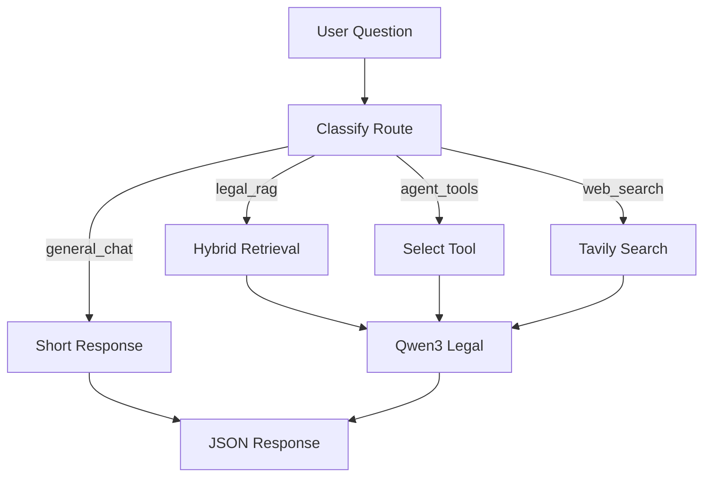

# ReAct Agent và Tool Routing

## Mục tiêu

ReAct Agent dùng vòng lặp Reasoning + Acting để quyết định khi nào trả lời bằng RAG, khi nào gọi tool tính toán pháp lý, và khi nào cần web search. Trong kiến trúc hiện tại, Agent chạy phía backend FastAPI và trả JSON/SSE cho React.

## Route chính

- `legal_rag`: câu hỏi cần tra cứu văn bản pháp luật trong corpus local.
- `agent_tools`: câu hỏi cần tính toán, kiểm tra điều kiện hoặc xử lý logic pháp lý có tham số.
- `web_search`: câu hỏi cần thông tin mới, ngoài corpus local.
- `general_chat`: chào hỏi, cảm ơn hoặc câu hỏi ngoài phạm vi pháp luật.

## Luồng ReAct



## Quy tắc định tuyến

- Ưu tiên `legal_rag` nếu câu hỏi hỏi quy định, điều kiện, thủ tục, quyền và nghĩa vụ.
- Ưu tiên `agent_tools` nếu câu hỏi có con số, tỷ lệ, tuổi, tài sản, thời hạn hoặc yêu cầu "tính".
- Ưu tiên `web_search` nếu câu hỏi chứa "mới nhất", năm hiện tại, văn bản mới ban hành, tin tức hoặc dữ kiện dễ thay đổi.
- Dùng `general_chat` cho câu chào, cảm ơn, hoặc câu không thuộc miền pháp luật.

## Tools

### Tavily Search

Tool tìm kiếm web có cấu trúc, dùng khi dữ liệu local không đủ hoặc câu hỏi cần cập nhật. Kết quả phải được gắn nguồn và ngày truy cập nếu dùng trong câu trả lời.

Interface:

```python
def tavily_search_tool(query: str, max_results: int = 5) -> list[dict]:
    ...
```

### Legal Calculation

Nhóm tool tính toán pháp lý dùng cho các câu hỏi có tham số rõ ràng.

Các tool baseline:

- `contract_penalty_calculator`: tính phạt hợp đồng theo giá trị, tỷ lệ phạt và số ngày.
- `legal_age_checker`: kiểm tra tuổi pháp lý.
- `inheritance_calculator`: chia thừa kế cơ bản theo hàng thừa kế.
- `business_name_validator`: kiểm tra tên doanh nghiệp theo quy tắc đặt tên.

## Output contract

Agent không trả text tự do trực tiếp cho frontend. Mọi response cần qua schema:

```text
route, answer, citations, tool_calls, retrieval_hits, confidence, warnings
```

## Nguyên tắc an toàn

- Không dùng web search nếu câu trả lời có thể suy ra chắc từ corpus local.
- Không cho tool tính toán tự tạo tham số còn thiếu.
- Nếu thiếu dữ kiện, trả về câu hỏi làm rõ trong `answer`.
- Nếu không đủ căn cứ pháp luật, Qwen3 phải nói rõ không tìm thấy cơ sở trong context.
