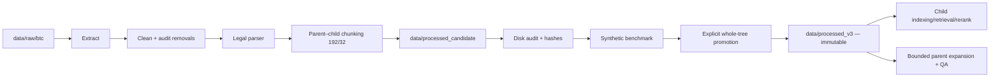

# Kiến trúc Data Pipeline

Pipeline chuẩn hóa dữ liệu BTC cho LegalIR và LegalQA theo mô hình phát hành hai
pha: tạo candidate có thể ghi, sau đó promote nguyên cây thành corpus V3 bất biến.



## Ranh giới ghi/đọc

- ETL chỉ ghi vào `data/processed_candidate` mới và rỗng. Library lẫn CLI đều
  từ chối output đã có dữ liệu.
- Audit và benchmark hoàn tất trong candidate trước khi release.
- Promotion di chuyển đủ `documents`, `chunks`, `parents`, `benchmarks` và
  `metadata` sang `data/processed_v3`; không copy từng phần.
- V3 là read-only. TV1/TV2/TV3/TV5 và pipeline GPU chỉ tiêu thụ V3.

## Contract dữ liệu

Child chunk dùng để embedding, retrieval và reranking:

```json
{
  "chunk_id": "law_001_article_10_clause_1",
  "doc_id": "law_001",
  "parent_id": "law_001_article_10",
  "text": "Nội dung khoản...",
  "parent_text": null,
  "metadata": {
    "law_name": "Tên văn bản",
    "article": "Điều 10",
    "clause": "Khoản 1",
    "structure_status": "structured",
    "source": "data/raw/btc/..."
  }
}
```

Parent text được lưu một lần trong `parents/*.jsonl`. Luồng online luôn là
**retrieve child → rerank child → tra `parent_id` → mở rộng parent có giới hạn →
QA**, không đưa toàn bộ parent vào index child.

Cấu hình chunking chuẩn là:

```yaml
chunk_size: 192
chunk_overlap: 32
```

## Khả năng phục hồi và minh bạch

- `partial`: giữ phần parse đáng tin cậy, kèm warning/manual review.
- `unstructured_fallback`: giữ nội dung tìm kiếm được bằng chunk đoạn/câu và gắn
  cờ fallback.
- `empty_source`: giữ định danh của passage BTC rỗng bằng chunk có
  `structure_type=empty_source_placeholder`; không tạo căn cứ pháp luật giả.

Nhờ đó một lỗi regex không âm thầm làm rơi document, đồng thời consumer vẫn biết
mức độ tin cậy của cấu trúc.

## Integrity và versioning

Candidate chỉ được promote khi disk audit/processing manifest xác nhận integrity,
file/record counts và parent mapping; không có duplicate, orphan, invalid, empty,
oversized, thiếu metadata hay child lặp `parent_text`. Audit còn kiểm tra độ phủ
token/bigram nguồn và coverage của gold LegalIR/LegalQA.

`processing_manifest.json` ghim Git commit, source hash, cấu hình 192/32, counts,
processed tree hash và benchmark SHA-256/provenance. Bất kỳ thay đổi corpus hoặc
model revision nào cũng làm mất hiệu lực index/candidate/evaluation cũ.

## Entry point

```powershell
python scripts/data_prep/run_ingestion.py `
  --raw-directory data/raw/btc `
  --processed-root data/processed_candidate `
  --chunk-size 192 `
  --chunk-overlap 32 `
  --benchmark-count 100 `
  --benchmark-seed 2026
```

Chi tiết vận hành, gate và promotion xem
[TV4 setup](../members/tv4/tv4_setup.md); mô tả kỹ thuật đầy đủ xem
[Data Pipeline chi tiết](../project/11_data_pipeline.md). Consumer GPU xem
[TV5 GPU runbook](../members/tv5/tv5_gpu_runbook.md).
