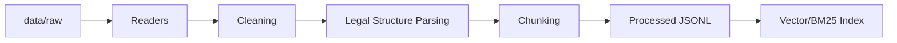

# Data Pipeline cho LegalIR & LegalQA

## Mục tiêu

Data Pipeline chuẩn hóa dữ liệu pháp luật thô thành chunk có metadata đầy đủ để phục vụ indexing, retrieval, QA và citation.

## Luồng tổng thể



## Bước 1: Đọc dữ liệu thô

Nguồn dữ liệu có thể là PDF, DOCX, TXT, JSON hoặc JSONL từ ban tổ chức. Reader cần trả về object thống nhất:

```text
doc_id, source_path, title, raw_text, metadata
```

## Bước 2: Làm sạch

Các thao tác bắt buộc:

- Chuẩn hóa Unicode tiếng Việt.
- Loại bỏ khoảng trắng thừa, tab, dòng trống liên tiếp.
- Xử lý header/footer, số trang và ký tự nhiễu nếu có.
- Giữ lại dấu câu và số điều khoản vì rất quan trọng cho pháp luật.

Không được làm mất cấu trúc như `Điều`, `Khoản`, `Điểm`.

## Bước 3: Bóc tách cấu trúc pháp luật

Parser cần nhận diện:

- Tên văn bản.
- Chương, mục, tiểu mục.
- Điều.
- Khoản.
- Điểm.

Metadata tối thiểu:

```text
doc_id, law_name, chapter, section, article, clause, point, effective_date, source
```

## Bước 4: Chunking

Nguyên tắc:

- Ưu tiên chunk theo đơn vị pháp lý, không cắt ngang khoản nếu tránh được.
- Chunk quá ngắn có thể gộp với context cha.
- Chunk quá dài có thể chia theo câu nhưng vẫn giữ metadata điều/khoản.
- Thêm overlap nhỏ khi chia đoạn dài để không mất ngữ cảnh.

Baseline:

```yaml
chunk_size: 192
chunk_overlap: 32
```

## Định dạng JSONL cho retrieval

```json
{
  "chunk_id": "law_001_article_10_clause_1",
  "doc_id": "law_001",
  "text": "Nội dung điều khoản...",
  "metadata": {
    "law_name": "Bộ luật Lao động 2019",
    "article": "Điều 10",
    "clause": "Khoản 1",
    "source": "data/raw/btc/..."
  }
}
```

## Định dạng QA/Instruction cho thí nghiệm LLM

QA format:

```json
{"question": "Câu hỏi pháp luật", "answer": "Câu trả lời có căn cứ"}
```

Instruction format:

```json
{
  "instruction": "Trả lời câu hỏi pháp luật sau dựa trên căn cứ được cung cấp.",
  "input": "Câu hỏi của người dùng",
  "output": "Câu trả lời mong muốn"
}
```

## Validation

Checklist:

- Mỗi dòng JSONL parse được.
- Không có `chunk_id` trùng.
- Text không rỗng và không mất dấu tiếng Việt.
- Metadata citation không rỗng với chunk pháp luật.
- Số lượng records sau xử lý được ghi vào metadata.

## Output bàn giao

- `data/processed/documents/`: tài liệu đã chuẩn hóa.
- `data/processed/chunks/`: chunk JSONL để index.
- `data/processed/metadata/`: thống kê xử lý và validation report.
