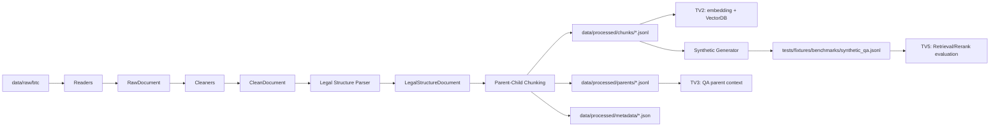

# TV4 Setup — Legal ETL & Synthetic Benchmark

TV4 chịu trách nhiệm biến văn bản pháp luật thô thành dữ liệu có cấu trúc cho
Retrieval, Reranking, QA và Evaluation. Phạm vi là ETL, chunking, validation và
synthetic benchmark; TV4 không làm Web Frontend, FastAPI router, retrieval,
vector search, reranking hoặc LLM inference.

## 1. Luồng dữ liệu TV4 bàn giao



Luồng chạy đầy đủ được cung cấp bởi:

```python
from udsc2026.ingestion import run_ingestion_pipeline

result = run_ingestion_pipeline(
    raw_directory="data/raw/btc",
    processed_root="data/processed",
)
```

`run_ingestion_pipeline()` lần lượt gọi extract, clean, parse/chunk, ghi JSONL
và validation report. Các lỗi riêng lẻ khi extract/clean được ghi log, không làm
dừng toàn bộ corpus.

## 2. Cài đặt môi trường

- Python 3.10 trở lên.
- Cài dependency phát triển và chạy test:

  ```powershell
  py -3.10 -m pip install -r requirements_dev.txt
  ```

- Các thư viện ETL chính: `pydantic`, `charset-normalizer`, `python-docx` và
  `pdfplumber`. `python-docx` chỉ cần khi đọc/sinh DOCX; `pdfplumber` chỉ cần
  khi đọc PDF.
- Khi chạy trực tiếp từ repository trên PowerShell, đặt `PYTHONPATH`:

  ```powershell
  $env:PYTHONPATH = "src"
  ```

## 3. Những phần đã hoàn thành

### Readers — nhận dữ liệu BTC

Vị trí: `src/udsc2026/ingestion/readers/`

- Đọc `.txt`, `.json`, `.jsonl`, `.docx` và `.pdf` theo phần mở rộng.
- Chuẩn hoá đầu ra thành `RawDocument`: `doc_id`, `source_path`, `title`,
  `raw_text`, `file_format`, `metadata`.
- JSON/JSONL có field `content`, `text`, `body`, `raw_text` hoặc
  `document_text` được lấy đúng nội dung pháp luật để các bước sau parse được.
- Batch extraction bỏ qua file lỗi, phát hiện `doc_id` trùng và ghi
  `data/processed/metadata/extract_errors.json`.

### Cleaners — làm sạch nhưng không phá cấu trúc luật

Vị trí: `src/udsc2026/ingestion/cleaners/`

- Chuẩn hoá Unicode NFC, khoảng trắng, lỗi OCR phổ biến và một số cách đặt dấu
  tiếng Việt cũ.
- Bỏ watermark, số trang, header/footer lặp và mục lục nhiễu.
- Giữ xuống dòng mở đầu Điều/Khoản/Điểm để parser vẫn nhận diện được cấu trúc.
- Trích từ viết tắt theo từng văn bản, ví dụ `BLLĐ → Bộ luật Lao động`.
- Ghi tài liệu đã clean vào `data/processed/documents/<doc_id>.json` và lỗi vào
  `data/processed/metadata/clean_errors.json`.

### Legal structure parser — cây phân cấp pháp luật

Vị trí: `src/udsc2026/ingestion/legal_structure/`

- Dùng state machine và regex neo đầu dòng để nhận diện `law_name`, Chương,
  Mục, Điều, Khoản, Điểm.
- Hỗ trợ các dạng phổ biến: `Chương I`, `Mục 1`, `Điều 10.`, `1.`, `a)`;
  giữ đúng thứ tự xuất hiện trong `entries`.
- Chỉ coi `1.` và `a)` là Khoản/Điểm sau khi đang ở trong một Điều, giảm false
  positive từ danh sách thường.
- Văn bản không có Điều được gắn `requires_manual_review`; chunker không cắt
  mù các văn bản này.

### Parent-child chunking — dữ liệu cho Retrieval và QA

Vị trí: `src/udsc2026/ingestion/chunking/`

- Parent là toàn bộ Điều (`LegalParent`); child ưu tiên Khoản/Điểm (`LegalChunk`)
  hoặc `_body` nếu Điều không có Khoản.
- Child giữ `chunk_id`, `parent_id`, `doc_id`, `parent_text` cùng metadata
  `law_name`, `chapter`, `section`, `article`, `clause`, `point`, `source`,
  `expanded_terms`, số ký tự và token.
- Chunk dài tách theo câu với overlap; nếu một câu duy nhất vượt giới hạn, chỉ
  fallback theo ranh giới token trong chính câu đó, không cắt ký tự và không
  vượt sang Khoản/Điểm khác.
- Validation kiểm tra chunk rỗng/quá dài, metadata thiếu, Unicode, ID trùng,
  child không có parent và khả năng ghi JSONL.

### Synthetic benchmark generator — dữ liệu đánh giá

Vị trí: `src/udsc2026/evaluation/synthetic_generator.py`

- Đọc `LegalChunk` từ một file hoặc thư mục JSONL đã chunk.
- Sinh chính xác 100–200 Q&A có `question_id`, `question`, `answer`,
  `gold_chunk_ids`, `gold_citations`, `law_name`, `article`, `difficulty` và
  `question_type`.
- Nhóm câu hỏi: `definition`, `condition`, `rights_obligations`, `penalty`,
  `procedure`, `comparison`, `multi_clause`.
- Câu trả lời là trích xuất chuẩn hoá từ gold chunk; so sánh/nhiều khoản luôn
  trỏ tới tối thiểu hai chunk/citation. Không dùng LLM hoặc tự thêm fact.
- Đã tinh chỉnh `_format_answer()` trong `src/udsc2026/evaluation/synthetic_generator.py` để answer synthetic giữ văn phong văn xuôi ổn định cho benchmark và thi đấu, đồng thời đối chiếu theo `warmup Task 2.json` để khớp style câu trả lời tham chiếu, nhưng vẫn giữ nguyên schema `gold_chunk_ids` và `gold_citations`.

### Test tự động và mock corpus

- Unit/integration test nằm ở `tests/`: readers, cleaners, parser, chunking,
  ETL pipeline và synthetic generator.
- Entry point mock corpus: `scripts/data_prep/generate_mock_btc_data.py`. Script này gọi
  generator corpus giả lập hiện có, không dùng dữ liệu BTC thật.
- Khi chạy, corpus mock được ghi vào `data/raw/btc/mock/`, gồm:
  `mock_btc_law.txt`, `mock_btc_law.json`, `mock_btc_laws.jsonl` và
  `mock_btc_law_docx.docx` nếu có `python-docx`.
- Corpus mock có watermark `DỰ THẢO`, từ viết tắt BLLĐ, kiểu dấu cũ `hoà/uý`
  và cấu trúc Chương → Mục → Điều → Khoản → Điểm để thử toàn bộ ETL.

## 4. Output và đơn vị nhận bàn giao

| Output | Nội dung | Bên sử dụng |
| --- | --- | --- |
| `data/processed/documents/<doc_id>.json` | CleanDocument để audit/trace nguồn | TV4, TV1 |
| `data/processed/chunks/<doc_id>.jsonl` | LegalChunk nhỏ để embedding, BM25, dense/hybrid retrieval | TV2; TV5 benchmark/rerank |
| `data/processed/parents/<doc_id>.jsonl` | Toàn bộ Điều theo `parent_id`, context rộng cho QA | TV3; TV5 |
| `data/processed/metadata/extract_errors.json` | File lỗi hoặc `doc_id` trùng khi extract | TV4, TV1 |
| `data/processed/metadata/clean_errors.json` | Tài liệu lỗi khi clean | TV4, TV1 |
| `data/processed/metadata/validation_report.json` | Thống kê document/article/chunk và chỉ số lỗi | TV1, TV4, TV5 |
| `data/processed/metadata/manual_review_documents.json` | Văn bản không có Điều, cần xử lý thủ công | TV4 |
| `tests/fixtures/benchmarks/synthetic_qa.jsonl` | 100–200 Q&A có gold chunk/citation | TV5; TV1/TV2/TV3 để smoke test |

TV2 index child chunks vào Qdrant/FAISS/BM25 và phải bảo toàn citation metadata.
TV3 dùng `parent_id` hoặc `parent_text` khi cần context Điều đầy đủ để trả lời.
TV5 dùng benchmark của TV4 để đo Recall@K, MRR, chất lượng rerank và latency.
TV1 gọi pipeline hoặc đọc các output chuẩn để tích hợp backend end-to-end.

## 5. Chạy thử ETL và benchmark

### Bước 1 — tạo corpus giả lập (tuỳ chọn)

Tui có tạo một script sinh dữ liệu giả lập trong scripts/data_prep/generate_mock_btc_data.py
*Lưu ý: không chạy bước này nếu đã có dữ liệu BTC thật trong `data/raw/btc/`.

```powershell
py -3.10 scripts/data_prep/generate_mock_btc_data.py
```

chạy xong, dữ liệu thô giả lập sẽ được lưu trong data/raw/btc

### Bước 2 — chạy ETL

```powershell
$env:PYTHONPATH = "src"
py -3.10 -c "from udsc2026.ingestion import run_ingestion_pipeline; print(run_ingestion_pipeline())"
```

Sau bước này kiểm tra `chunks/`, `parents/`, `documents/` và
`metadata/validation_report.json` trong `data/processed/`.

### Bước 3 — sinh benchmark 100 Q&A

Corpus chuẩn cần có căn cứ cho đủ bảy nhóm câu hỏi. Generator sẽ báo rõ nhóm
thiếu thay vì tạo câu hỏi không có căn cứ.

```powershell
$env:PYTHONPATH = "src"
py -3.10 -m udsc2026.evaluation.synthetic_generator `
  --chunks-dir data/processed/chunks `
  --output tests/fixtures/benchmarks/synthetic_qa.jsonl `
  --count 100
```

Với corpus nhỏ chỉ để khám phá module, có thể dùng `--allow-missing-types`.
Không dùng chế độ này làm benchmark nghiệm thu vì có thể thiếu một số nhóm câu
hỏi pháp lý.

### Bước 4 — chạy test

```powershell
$env:PYTHONPATH = "src"
py -3.10 -m pytest -q -o addopts=''
```

## 6. Ranh giới trách nhiệm TV4

TV4 cung cấp dữ liệu, schema và benchmark có thể tái lập. TV4 không phụ trách
Web Frontend, FastAPI endpoint, embedding model, VectorDB indexing, retrieval,
reranking hay sinh câu trả lời LLM. Các module đó thuộc lần lượt TV1, TV2, TV5
và TV3; TV4 chỉ bảo đảm input cho họ sạch, có cấu trúc và truy vết được.
