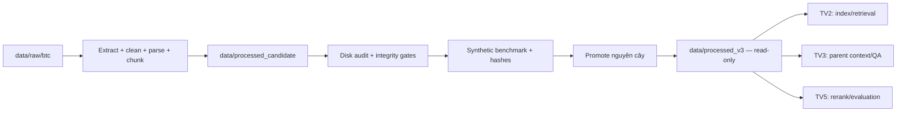

# TV4 Setup — Legal ETL và synthetic benchmark

TV4 chịu trách nhiệm biến dữ liệu BTC thô thành corpus có thể kiểm tra, truy vết
và bàn giao cho indexing/evaluation. ETL luôn ghi vào một thư mục ứng viên mới;
không thành phần nào được ghi trực tiếp vào corpus chính thức.

## Quy ước thư mục

| Đường dẫn | Vai trò | Quyền ghi |
| --- | --- | --- |
| `data/raw/btc` | Nguồn LegalIR/LegalQA của BTC | Chỉ đọc khi chạy ETL |
| `data/processed_candidate` | Kết quả của một lần ETL mới | Chỉ pipeline ingestion ghi |
| `data/processed_v3` | Corpus đã audit và được phát hành | Bất biến, mọi consumer chỉ đọc |

`run_ingestion_pipeline()` và CLI đều từ chối chạy nếu output đã có dữ liệu.
Muốn chạy lại, hãy chọn một đường dẫn ứng viên mới hoặc chủ động dọn đúng thư
mục ứng viên; không trộn hai lần chạy và không ghi đè V3.

## Luồng bàn giao



## Cài đặt

Khuyến nghị Python 3.11 (hỗ trợ 3.10–3.12):

```powershell
py -3.11 -m venv .venv
Set-ExecutionPolicy -Scope Process Bypass
.\.venv\Scripts\Activate.ps1
python -m pip install -r requirements_dev.txt
$env:PYTHONPATH = "$PWD\src"
```

## Chạy ETL chính thức

Từ repository root, bảo đảm `data/processed_candidate` chưa tồn tại hoặc đang
rỗng rồi chạy entry point hiện hành:

```powershell
python scripts/data_prep/run_ingestion.py `
  --raw-directory data/raw/btc `
  --processed-root data/processed_candidate `
  --chunk-size 192 `
  --chunk-overlap 32 `
  --benchmark-count 100 `
  --benchmark-seed 2026 `
  --progress-every 100
```

CLI stream từng document, in tiến độ, chạy audit sau khi ghi đĩa và sinh
benchmark khi integrity gate đạt. Exit code khác 0 nghĩa là chưa được promote.
Không dùng `--allow-missing-benchmark-types` cho corpus nghiệm thu.

## Contract chunk và parent

- Child chunk ưu tiên ranh giới Điều/Khoản/Điểm; đoạn dài mới chia theo câu/token
  với `chunk_size=192`, `chunk_overlap=32`.
- Child chứa `parent_id` nhưng `parent_text` luôn là `null`; nội dung parent chỉ
  được lưu một lần trong `parents/<doc_id>.jsonl`.
- Retrieval/index chỉ dùng child. Sau rerank, QA tra `parent_id` trong parent
  store để mở rộng context có giới hạn.
- Không nhúng nguyên `parent_text` vào từng child vì sẽ phình corpus và làm sai
  contract lưu trữ V3.

### Trường hợp cấu trúc không chắc chắn

- `structured`: parser nhận diện cấu trúc pháp luật đủ tin cậy.
- `partial`: vẫn giữ các chunk hợp lệ nhưng gắn cảnh báo và đưa document vào báo
  cáo review.
- `unstructured_fallback`: văn bản có nội dung nhưng không thể parse Điều ổn
  định; pipeline chunk theo đoạn/câu, giữ toàn văn có thể tìm kiếm và gắn
  `fallback_chunking=true`.
- `empty_source`: passage chính thức rỗng từ nguồn; pipeline tạo một chunk có
  `structure_type=empty_source_placeholder` và `synthetic_placeholder=true` để
  không làm mất ID. Đây là cảnh báo semantic, không phải nội dung pháp luật được
  suy diễn.

Các trạng thái trên phải được giữ nguyên trong metadata. Document bị gắn cờ
review không đồng nghĩa với bị loại khỏi corpus.

## Output của một candidate hoàn chỉnh

```text
data/processed_candidate/
├── documents/                       # CleanDocument để audit nguồn
├── chunks/                          # Child LegalChunk cho retrieval/rerank
├── parents/                         # LegalParent, lưu text riêng
├── benchmarks/synthetic_qa.jsonl    # Benchmark synthetic có provenance
└── metadata/
    ├── manifest.json
    ├── processing_manifest.json
    ├── disk_audit_report.json
    ├── validation_report.json
    ├── orphan_contexts.json
    └── manual_review_*.json
```

Các nguồn sự thật vận hành:

- `manifest.json`: hash corpus nguồn và thống kê context/QA BTC.
- `validation_report.json`: số document/chunk/parent, lỗi schema, fallback,
  partial và placeholder.
- `disk_audit_report.json`: đọc lại toàn bộ output; kiểm tra ID, parent mapping,
  metadata, zero-loss token/bigram, task coverage và `corpus_tree_hash`.
- `processing_manifest.json`: Git commit, cấu hình 192/32, counts, tree hash,
  các gate và SHA-256/provenance của benchmark.

Log tiến trình là artifact vận hành và nên đặt dưới `outputs/`; không ghi thêm
vào V3 sau khi phát hành.

## Gate và promote

Chỉ promote khi đồng thời thỏa các điều kiện sau:

1. CLI kết thúc thành công và `integrity_gate_passed=true` trong cả
   `disk_audit_report.json` lẫn `processing_manifest.json`.
2. `integrity_failures` rỗng; counts document/chunk/parent khớp file trên đĩa.
3. Benchmark tồn tại, đủ loại câu hỏi yêu cầu, và hash/count trong
   `processing_manifest.json` khớp artifact.
4. Các `semantic_issues`, placeholder, partial và manual-review đã được đọc và
   chấp nhận có căn cứ. Không sửa tay file trong candidate sau audit.

Promotion là thao tác phát hành có chủ đích: đích V3 phải chưa tồn tại và phải
di chuyển **nguyên cây** candidate, không copy lẻ `chunks` hoặc `metadata`:

```powershell
if (Test-Path -LiteralPath data/processed_v3) {
  throw "data/processed_v3 đã tồn tại; không được ghi đè corpus bất biến"
}
Move-Item -LiteralPath data/processed_candidate -Destination data/processed_v3
```

Sau promotion, tất cả TV1/TV2/TV3/TV5 chỉ đọc `data/processed_v3`. Nếu cần thay
corpus, tạo candidate mới, audit lại từ đầu và thực hiện một đợt phát hành mới.

## Kiểm thử

```powershell
python -m pytest tests/integration/test_ingestion_pipeline.py `
  tests/integration/test_ingestion_chunking.py `
  tests/unit/test_gpu_preflight.py -q -o addopts=''
```

## Tài liệu liên quan

- [Nhiệm vụ TV4](tv4.md)
- [Thiết kế pipeline chi tiết](../../project/11_data_pipeline.md)
- [Kiến trúc data pipeline](../../architecture/data_pipeline.md)
- [TV2 setup](../tv2/tv2_setup.md)
- [TV5 GPU runbook](../tv5/tv5_gpu_runbook.md)

TV4 không phụ trách embedding, VectorDB, retrieval, reranking hay LLM inference;
TV4 bàn giao corpus V3 sạch, truy vết được và có benchmark/hash tái lập.
