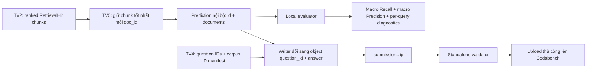

# TV5 — LegalIR Warm-up Runbook

> Cập nhật: 02/08/2026 (GMT+7)
> Phạm vi: metric ở cấp `document_id`, audit `warmup.json`, writer/validator
> `submission.zip` và bàn giao giữa TV2/TV4/TV5.

## 1. Kết luận cần nhớ

Task 1 không chấm câu trả lời văn xuôi và không chấm `chunk_id`. Với mỗi câu
hỏi, hệ thống phải xếp hạng các `document_id`:

- macro Recall là metric chính;
- macro Precision là metric phụ, dùng để phân hạng khi Recall bằng nhau;
- format nộp là `submission.zip` chứa duy nhất `submission.json`;
- JSON là object `question_id -> {"answer": [document_id, ...]}`;
- mỗi `answer` là danh sách document ID không trùng; BTC không còn yêu cầu tối
  thiểu ba document;
- mỗi question ID xuất hiện đúng một lần và document ID phải thuộc corpus BTC.

Mỗi câu có thể có nhiều gold document. Scorer so sánh tập document dự đoán với
toàn bộ tập gold của từng câu, sau đó macro-average trên các câu hỏi. Thứ tự
giảm dần relevance vẫn phải được giữ trong submission dù Recall/Precision không
dùng vị trí rank.

Theo công thức BTC, câu không dự đoán document nào nhận Precision bằng 0; writer
và validator vì vậy chấp nhận `"answer": []`. Đây chỉ là phương án fallback để
giữ đúng coverage, không phải chiến lược nhằm tối ưu điểm.

Contract trên đã được đối chiếu với file
`DSC2026_Task1_LegalIR_Data_Overview.docx` và trang công khai
[Codabench competition 17715](https://www.codabench.org/competitions/17715/)
ngày 02/08/2026. Tab giao diện có thể bị cache, nhưng public competition API đã
trả về đầy đủ nội dung trang “Hướng dẫn nộp bài”. Trước mỗi phase mới vẫn phải
kiểm tra lại thông báo của BTC. Warm-up hiện kết thúc lúc 23:59 ngày 05/08/2026
(GMT+7).

Image `codalab/codalab-legacy:py39` là runtime của scoring program phía
Codabench. Vòng hiện tại nhận file kết quả, không chạy source/model của đội bằng
image đó; repo vẫn dùng Python 3.10–3.12. Docker source của đội là yêu cầu tái
lập riêng dành cho Top 7.

## 2. Luồng TV5 đã chốt



Core adapter `legal_ir_prediction_from_hits()` collapse nhiều chunk của cùng một
văn bản theo thứ tự reranker: lần xuất hiện đầu tiên là chunk tốt nhất và trở
thành rank của document. Submission validator tách riêng để kiểm tra exact
question coverage, duplicate và corpus membership; không được tự chèn document
chỉ để đủ một số lượng tối thiểu không còn tồn tại trong contract BTC.

## 3. Audit dữ liệu Warm-up hiện tại

Chạy:

```powershell
python scripts/audit_legal_ir_warmup.py `
  --input data/task1/warmup.json `
  --output artifacts/task1/warmup_audit.json
```

Kết quả đã xác nhận trên file hiện có:

| Kiểm tra | Kết quả |
| --- | ---: |
| Số câu hỏi | 500 |
| Tổng answer labels | 542 |
| Document ID có label duy nhất | 426 |
| Câu có đúng một gold | 463 |
| Câu có nhiều gold | 37 |
| Phân bố số gold | 1: 463; 2: 33; 3: 3; 4: 1 |
| Question có thay đổi khi chuẩn hóa whitespace | 22 |
| Question chưa ở Unicode NFC | 5 |
| QID/document label có padding | 0 |
| Answer trùng trong cùng một câu | 0 |
| SHA-256 `warmup.json` | `fadfbcab2923c085980239396d5564c16c232714f42004a36ed2a3d93962c0f9` |

37 record có 2–4 document ID là dữ liệu multi-gold hợp lệ theo overview mới,
không còn là anomaly cần BTC giải thích. Toàn bộ `answer` phải được dùng làm tập
gold; code tuyệt đối không lấy riêng `answer[0]` hoặc biến một câu multi-gold
thành nhiều câu single-gold.

## 4. Contract đầu vào từ TV2 và TV4

### 4.1. Ranking từ TV2

TV2 bàn giao một JSON array **nội bộ**, chưa cần ZIP. Array này thuận tiện cho
pipeline nhưng không phải wire schema Codabench:

```json
[
  {
    "id": "147194",
    "documents": ["14681", "80245", "58109"]
  }
]
```

Yêu cầu:

- `id` và từng document ID là string, không ép số sang string ở bước cuối;
- ranking đã giảm dần theo relevance;
- không lặp document ID dù có nhiều chunk của cùng văn bản;
- có đủ chính xác question IDs của phase;
- chọn độ dài danh sách bằng threshold/top-K đã đo trên dev; không nối toàn bộ
  corpus vào mọi câu theo mặc định vì mỗi false positive làm giảm Precision.

Nếu đầu vào là `list[RetrievalHit]`, dùng adapter:

```python
from udsc2026.evaluation import legal_ir_prediction_from_hits

prediction = legal_ir_prediction_from_hits(
    question_id="147194",
    hits=reranked_hits,
    max_documents=100,
)
```

Adapter kiểm tra duplicate chunk, rank tường minh bị lệch và ID không hợp lệ;
object `RetrievalHit` đầu vào không bị sửa.

### 4.2. Manifest từ TV4

TV4 cần bàn giao hai nguồn:

1. file câu hỏi phase, `warmup.json`, hoặc manifest JSON array chỉ chứa ID,
   để lấy exact question coverage; loader chấp nhận mapping
   `id -> {question, answer?}` và array `{id, question?, answer?}`;
2. `corpus_document_ids.json`, là JSON array chứa mỗi document ID đúng một lần
   theo thứ tự deterministic.

Ví dụ:

```json
["740", "2026", "2113"]
```

Tài liệu context minh họa field `id` dạng số, còn submission yêu cầu string.
Việc chuyển kiểu phải được chốt một lần tại adapter ingestion/manifest và được
test đối chiếu với ID trong label; không ép kiểu lén trong evaluator/writer.

Hiện workspace chưa có `selected-contexts.zip`, nên TV5 có thể kiểm tra schema,
metric và đóng gói nhưng chưa thể chạy retrieval/model thật hay xác thực toàn bộ
document ID với khoảng 8.500 văn bản. Không dùng 426 labeled IDs của Warm-up như
thể đó là full corpus.

## 5. Chạy evaluation đúng cách

### 5.1. Official multi-gold Recall/Precision

```powershell
python scripts/evaluate_legal_ir.py `
  --references data/task1/warmup.json `
  --predictions artifacts/task1/predictions.json `
  --output artifacts/task1/evaluation/report.json
```

Với mỗi câu hỏi `q`, gọi `G_q` là tập gold và `P_q` là tập document dự đoán:

- `Recall_q = |P_q ∩ G_q| / |G_q|`;
- `Precision_q = |P_q ∩ G_q| / |P_q|`;
- macro Recall/Precision là trung bình metric tương ứng trên toàn bộ câu hỏi.

Report JSON cần chứa:

- `evaluation_mode`, `dataset_fingerprint` và số câu multi-gold;
- aggregate macro Recall/Precision;
- tập gold/prediction, số true positive và Recall/Precision cho từng câu.

Prediction coverage phải khớp reference theo ID, không phụ thuộc thứ tự record.
Thiếu/thừa/trùng ID hoặc trùng document trong một ranking đều bị từ chối.
Vì metric là set-based, thay đổi thứ tự không đổi điểm local; pipeline vẫn giữ
thứ tự giảm dần relevance theo hướng dẫn submission.

## 6. Ghi và validate submission

Tạo ZIP, chuyển prediction nội bộ sang object chính thức, rồi kiểm tra coverage
và corpus membership:

```powershell
python scripts/write_legal_ir_submission.py `
  --input artifacts/task1/predictions.json `
  --questions data/task1/warmup.json `
  --corpus-manifest artifacts/corpus_document_ids.json `
  --output artifacts/task1/submission.zip
```

Không bật `--append-missing-corpus` trong luồng release mặc định và không ép full
ranking. Mở rộng candidate list có thể tăng Recall nếu lấy thêm gold, nhưng mọi
false positive đều làm giảm Precision và đồng thời làm artifact lớn. Hãy chọn
threshold/top-K trên dev, theo dõi Recall là mục tiêu chính và Precision là tiêu
chí phụ/tiebreak, rồi khóa cấu hình trước khi tạo ZIP.

Validator độc lập trước khi upload:

```powershell
python scripts/validate_legal_ir_submission.py `
  --input artifacts/task1/submission.zip `
  --questions data/task1/warmup.json `
  --corpus-manifest artifacts/corpus_document_ids.json
```

Không dùng `--require-complete-ranking` trong luồng release: full corpus không
phải yêu cầu submission mới. Không bỏ `--questions`; chỉ bỏ
`--corpus-manifest` khi corpus thật chưa được bàn giao và ghi rõ rằng lúc đó
chưa kiểm tra được ID ngoài corpus.

Writer tạo JSON/ZIP deterministic và atomic. ZIP chỉ có `submission.json` ở
root; nội dung là object `question_id -> {"answer": [...]}`. Loader không
extract archive và chặn member thừa, zip-slip, symlink,
compression lạ, CRC lỗi, file quá kích thước, JSON key trùng, `NaN`/`Infinity`,
ID padding/control character và input không phải UTF-8.

## 7. Oracle smoke — tuyệt đối không nộp

Script dưới đây dùng trực tiếp `answer` để kiểm tra plumbing JSON → ZIP → loader.
Đây là label leakage, không phải model, không phải baseline và không được upload:

```powershell
python scripts/make_warmup_smoke_submission.py `
  --warmup data/task1/warmup.json `
  --output artifacts/task1/oracle_DO_NOT_SUBMIT.zip `
  --acknowledge-label-leakage
```

Script từ chối chạy nếu thiếu acknowledgement hoặc tên output không chứa
`DO_NOT_SUBMIT`. Mỗi câu trong artifact chỉ chứa đúng 1–4 gold document của câu
đó; 426 là tổng số gold ID duy nhất trên toàn Warm-up, không phải số document
được nối vào từng prediction. Artifact không thay thế model hoặc full corpus
manifest. Các report cũ mang tên `oracle_any_gold_report.json` dùng metric đã
ngừng áp dụng và không được dùng để so sánh kết quả mới.

## 8. Checklist trước khi upload thật

1. Xác nhận đang ở đúng phase và đọc lại hướng dẫn Codabench.
2. Dùng prediction do model tạo; không dùng oracle, gold labels hay dữ liệu ngoài
   phạm vi BTC cho phép.
3. Xác nhận question count và exact ID coverage.
4. Xác nhận document IDs bằng manifest trích từ corpus BTC.
5. Kiểm tra document ID không trùng, thứ tự giảm dần relevance và đúng
   threshold/top-K đã khóa; không tự bù cho đủ ba ID.
6. Chạy evaluator local trên reference hợp lệ nếu phase có labels.
7. Chạy standalone validator trên chính file ZIP sắp upload.
8. Mở ZIP kiểm tra chỉ có `submission.json`, không có thư mục cha hay
   `__MACOSX`.
9. Lưu checksum, config/model version và report tương ứng với submission.
10. Nhóm trưởng upload thủ công và lưu log chấm; TV5 không tự động submit thay
    người dùng.

## 9. Kiểm thử dành cho TV5

Chạy nhanh riêng phần mới:

```powershell
python -m pytest -q `
  tests/unit/test_evaluation/test_legal_ir.py `
  tests/unit/test_evaluation/test_legal_ir_submission.py `
  tests/unit/test_evaluation/test_legal_ir_cli.py
python scripts/smoke_test.py --mode host
```

Chạy toàn bộ quality gate:

```powershell
python -m ruff format --check .
python -m ruff check .
python -m mypy src --no-warn-unused-configs
python -m pydocstyle src
$env:OMP_NUM_THREADS = "1"
$env:OPENBLAS_NUM_THREADS = "1"
python -m pytest -q `
  --ignore=tests/unit/test_vector_db `
  --cov=src/udsc2026 `
  --cov-report=
python -m pytest -q tests/unit/test_vector_db `
  --cov=src/udsc2026 `
  --cov-append `
  --cov-report=term-missing `
  --cov-fail-under=70
python -m bandit -q -r src
```

Các script `check-all.ps1` và `check-ci-local.sh` pin OpenMP/BLAS về một worker
và tách VectorDB thành process riêng để tránh native abort của FAISS 1.8 trên
macOS sau khi process đã load đồng thời Torch/SciPy và tạo/hủy nhiều index nhỏ.
Coverage được append giữa hai shard. Cách chạy này vẫn thực thi toàn bộ test;
nó chỉ cô lập native runtime, không thay đổi inference hay benchmark latency
production.

## 10. Phân công tiếp theo

- **TV2:** sinh ranking document-level thật và báo cấu hình dense/BM25/hybrid/
  reranker cho mỗi run.
- **TV4:** bàn giao `selected-contexts`, canonical corpus manifest, checksum và
  validation giữa corpus IDs với labels.
- **TV5:** chạy before/after rerank, phân tích per-query lỗi, validate artifact,
  tune threshold/top-K theo Recall trước và Precision sau, lưu report/checksum
  và bàn giao ZIP cho nhóm trưởng.
- **Nhóm trưởng:** thực hiện upload chính thức và lưu kết quả Codabench.

Chưa có corpus/model prediction thì kết quả đúng của TV5 là một pipeline đã
được test chặt và một danh sách dependency còn thiếu; không được gọi oracle hoặc
fixture là điểm mô hình.
