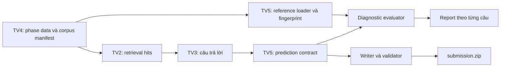

# TV5 — LegalQA Warm-up Runbook

> Cập nhật contract Codabench: 01/08/2026 (GMT+7)
> Phạm vi: audit dữ liệu Task 2, đánh giá câu trả lời bằng profile diagnostic
> METEOR/ROUGE-L, kiểm tra coverage, đóng gói `submission.zip` và bàn giao giữa
> TV2/TV3/TV4/TV5.

## 1. Điều đã biết và điều chưa được suy diễn

Tài liệu Task 2 mô tả:

- input là một câu hỏi pháp luật tiếng Việt;
- output là câu trả lời tự nhiên bằng văn xuôi;
- METEOR là độ đo chính;
- ROUGE-L là độ đo phụ;
- dữ liệu đầy đủ dự kiến gồm khoảng 8.500 văn bản và 10.000 câu hỏi;
- kho context được phát hành dưới dạng `selected-contexts.zip`.

Contract nộp bài hiện tại là `submission.zip` chứa duy nhất
`submission.json`. JSON là một **object keyed by `question_id`**; mỗi value là
object có đúng field `answer` kiểu string:

```json
{
  "156765": {
    "answer": "Câu trả lời do hệ thống sinh ra..."
  }
}
```

Contract này được đối chiếu với trang công khai
[Codabench Task 2](https://www.codabench.org/competitions/17716/) ngày
01/08/2026. File overview `.docx` mô tả dữ liệu và metric nhưng không cố định
wire schema nộp bài. ID được xem là chuỗi opaque; không ép sang số và không
sắp xếp theo giá trị số. Phải kiểm tra lại trang Codabench trước mỗi phase vì
hướng dẫn có thể được BTC cập nhật.

Tài liệu overview chưa công bố implementation chính xác của METEOR/ROUGE-L:
tokenizer, Unicode/case normalization, stemming, synonym resource, tham số
METEOR, biến thể `rougeL` hay `rougeLsum` và quy tắc làm tròn. Vì vậy report
hiện tại luôn ghi rõ profile `diagnostic`; không tuyên bố parity với scorer
Codabench cho đến khi có source/config hoặc golden result từ BTC.

## 2. Ranh giới trách nhiệm



TV5 phụ trách contract, metric, report, validator, packager và tính tái lập.
TV5 không thay TV2 tối ưu retrieval, không thay TV3 thiết kế prompt/sinh câu
trả lời và không sửa nội dung reference do TV4 bàn giao.

Hai loại artifact phải tách biệt:

- prediction nội bộ là array `{id, answer}` để evaluator và pipeline trao đổi;
- submission chính thức là root object `question_id -> {answer}`;
- trace phát triển có thể chứa retrieval hits, citation, latency, model/prompt
  version nhưng không được đưa thêm vào submission.

## 3. Audit dữ liệu Warm-up

Dữ liệu canonical nằm tại:

```text
data/task2/warmup.json
```

Chạy audit:

```powershell
python scripts/audit_legal_qa_warmup.py `
  --input data/task2/warmup.json `
  --output artifacts/task2/warmup_audit.json
```

Audit hiện tại phải cho kết quả chính sau:

| Thuộc tính | Giá trị |
| --- | ---: |
| Số câu hỏi | 500 |
| Tổng reference answer | 500 |
| Question cần chuẩn hóa whitespace | 31 |
| Question không ở NFC | 3 |
| Answer có xuống dòng | 498 |
| Answer không ở NFC | 18 |
| Answer chứa NBSP `U+00A0` | 8 record / 42 ký tự |
| Answer chứa soft hyphen `U+00AD` | 1 record / 4 ký tự |
| Answer chứa embedded BOM `U+FEFF` | 3 record / 3 ký tự |
| Answer chứa format character (`Cf`) | 4 record / 7 ký tự |
| Answer có blank line | 161 record / 170 dòng |
| Answer có trailing whitespace trong dòng | 20 record / 37 dòng |
| Answer ngắn nhất | 176 ký tự |
| Answer trung vị | 1.373 ký tự |
| Answer dài nhất | 8.089 ký tự |
| SHA-256 | `b824e4f18bd9181c021498a28e402b7374d6d559f2ff28caa4120a9d932f82c5` |

Audit không ghi đè dữ liệu gốc. `raw_question` và `raw_answer` phải được giữ
nguyên; mọi normalization chỉ tồn tại trong metric profile hoặc retrieval
view. Đặc biệt không collapse newline của answer vì điều này có thể làm thay
đổi ROUGE-L nếu scorer chính thức dùng sentence boundaries.

## 4. Contract prediction nội bộ và đánh giá diagnostic

Prediction JSON nội bộ dùng array để dễ căn chỉnh và phát hiện ID trùng. Đây
không phải wire schema trong ZIP:

```json
[
  {
    "id": "156765",
    "answer": "Câu trả lời do hệ thống sinh ra..."
  }
]
```

Yêu cầu:

- root là JSON array không rỗng;
- mỗi object có đúng `id` và `answer`;
- cả hai field là string, không coercion;
- ID không rỗng, không padded, không có control character;
- mỗi ID xuất hiện đúng một lần;
- prediction coverage phải khớp hoàn toàn reference;
- không tự strip, casefold, NFC hoặc sửa newline của answer tại file boundary.

Chạy evaluator:

```powershell
python scripts/evaluate_legal_qa.py `
  --references data/task2/warmup.json `
  --predictions artifacts/task2/predictions.json `
  --output artifacts/task2/evaluation/diagnostic_report.json
```

Evaluator căn chỉnh bằng ID, không phụ thuộc thứ tự prediction. Report gồm:

- schema/profile version và cảnh báo diagnostic;
- dataset/prediction fingerprint;
- aggregate METEOR và ROUGE-L;
- điểm, độ dài prediction/reference theo từng câu;
- số lượng câu và exact coverage.

METEOR là trường xếp trước trong summary vì là metric chính theo overview. Tuy
nhiên profile hiện tại chỉ dùng exact normalized-token matching, không tải
WordNet, không áp dụng English Porter stemmer và không dùng PyVi word
segmentation. Lựa chọn này giúp chạy offline/reproducible, không có nghĩa là
trùng scorer BTC.

Trước khi đổi profile thành official phải chốt bằng văn bản:

1. package và version scorer;
2. tokenizer và Unicode/case/punctuation policy;
3. stemming/synonym resource và ngôn ngữ;
4. tham số METEOR (`alpha`, `beta`, `gamma`);
5. ROUGE-L F1 hay biến thể khác, có xử lý newline theo summary hay không;
6. cách tính macro, missing/empty answer và precision làm tròn.

## 5. Viết và validate submission chính thức

Writer luôn kiểm tra exact question coverage. `--questions` chấp nhận:

- root mapping `id -> {question, answer}` của Warm-up;
- root mapping question-only `id -> {question}` cho Public/Private;
- JSON array các ID string;
- JSON array object chứa `id` và tùy chọn `question`/`answer`.

Đóng gói:

```powershell
python scripts/write_legal_qa_submission.py `
  --input artifacts/task2/predictions.json `
  --questions data/task2/warmup.json `
  --output artifacts/task2/submission.zip
```

Nếu bỏ `--output`, writer dùng `LEGAL_QA_SUBMISSION_PATH`; fallback là
`artifacts/task2/submission.zip`.

Validate độc lập:

```powershell
python scripts/validate_legal_qa_submission.py `
  --input artifacts/task2/submission.zip `
  --questions data/task2/warmup.json
```

Writer/validator phải bảo đảm:

- ZIP có đúng một member tên `submission.json` ở root;
- JSON trong ZIP là root object `question_id -> {"answer": string}` và mỗi
  nested object không có field thừa;
- không chấp nhận path traversal, symlink/special member, encryption, member
  trùng, compression lạ hoặc file vượt safety limit;
- JSON UTF-8 strict, không BOM trong output, không `NaN`/`Infinity`, không
  duplicate object key;
- exact ID coverage; root key tự biểu diễn ID nên duplicate key phải bị từ chối
  ngay khi parse JSON;
- output atomic, deterministic và không được trùng/hard-link/symlink tới input;
- artifact được load/validate lại sau khi ghi.

Theo schema công khai, `answer` phải là string nhưng chưa cấm string rỗng. CLI
writer/validator dùng
`--empty-answer-policy error` làm release gate mặc định để tránh vô tình nộp
câu rỗng hoặc chỉ có whitespace; policy này không sửa nội dung answer. Dùng
`--empty-answer-policy allow` chỉ khi cần kiểm tra artifact theo schema thuần,
hoặc `warn` để vẫn ghi/validate nhưng phát cảnh báo rõ trên stderr.

Luôn lưu checksum của ZIP cùng report, model/config, prompt version và Git SHA
của run tạo ra nó.

## 6. Oracle smoke có rò rỉ nhãn

Oracle chỉ kiểm tra đường ống loader → writer → ZIP → validator. Nó copy trực
tiếp reference answer nên không đo năng lực mô hình và tuyệt đối không được
upload:

```powershell
python scripts/make_legal_qa_warmup_smoke_submission.py `
  --warmup data/task2/warmup.json `
  --output artifacts/task2/oracle_DO_NOT_SUBMIT.zip `
  --acknowledge-label-leakage
```

Guard bắt buộc:

- phải truyền `--acknowledge-label-leakage`;
- filename phải chứa đúng `DO_NOT_SUBMIT`;
- stderr phải hiện cảnh báo label leakage;
- artifact chỉ dùng local, không dùng làm baseline và không gửi Codabench.

Smoke bình thường nên dùng prediction giả hoặc output model thật, không dùng
reference answer.

## 7. Handoff giữa các thành viên

### TV4 → TV5

- phase data immutable và checksum;
- question manifest đúng order, ID là string;
- báo cáo schema/Unicode/duplicate/empty;
- corpus/context manifest khi BTC phát hành;
- benchmark phát triển có provenance và split, không sửa tay reference.

TV5 khóa dataset fingerprint trước mọi so sánh run.

### TV2 → TV5

- đúng một retrieval run cho mỗi question ID;
- ranked `RetrievalHit` giữ `chunk_id`, `doc_id`, text, citation metadata,
  scores và rank;
- index/config fingerprint, `candidate_k`, `top_k` và latency;
- exact coverage, không duplicate hit ID.

Retrieval score chỉ là diagnostic cho Task 2, không trộn vào METEOR/ROUGE-L.

### TV3 → TV5

- canonical prediction nội bộ `{id, answer}` cho toàn bộ question manifest;
- model/checkpoint, decoding config và prompt version;
- trace/citation/warning ở file riêng;
- không đưa markdown wrapper hoặc debug log ngoài ý muốn vào answer.

### TV5 → cả nhóm

- aggregate và per-query metric report;
- error slices: retrieval miss, answer thiếu ý, answer thừa dài, sai citation,
  Unicode/format drift;
- validated ZIP, checksum và release checklist;
- cảnh báo rõ profile diagnostic hay official.

## 8. Definition of Done

Một run Warm-up Task 2 chỉ được bàn giao khi:

1. audit khớp 500 record và checksum canonical;
2. prediction có exact coverage, ID không trùng/thiếu/thừa;
3. raw answer không bị loader/writer tự ý mutate;
4. aggregate metric bằng trung bình per-query trong cùng report;
5. report ghi metric profile và fingerprint;
6. ZIP hai lần từ cùng input có byte giống nhau;
7. ZIP round-trip trả lại đúng ID/answer, wire JSON là root object và archive
   chỉ có `submission.json`;
8. test malformed JSON, duplicate key/ID, unsafe ZIP, collision và size limit
   đều fail có chủ đích;
9. unit, CLI subprocess, Ruff và mypy đều pass;
10. artifact oracle nếu có phải mang `DO_NOT_SUBMIT` và không được bàn giao để
    upload;
11. trước khi claim official parity, metric phải được đối chiếu với scorer BTC
    trên golden fixture trong tolerance đã chốt.

## 9. Thứ tự triển khai thực tế

1. Audit và khóa checksum dữ liệu.
2. Chốt canonical reference/prediction contract.
3. Chạy metric conformance tests và ghi profile diagnostic.
4. Tạo evaluator cùng per-query report.
5. Chốt exact coverage từ question manifest.
6. Ghi, round-trip và validate ZIP.
7. Nhận prediction model thật từ TV3, retrieval trace từ TV2 và data manifest
   từ TV4.
8. Chạy error analysis, regression gate và mới tạo artifact bàn giao.

Không dùng điểm diagnostic để khẳng định thứ hạng dự kiến trên Codabench khi
exact scorer profile chưa được công bố hoặc xác minh.
