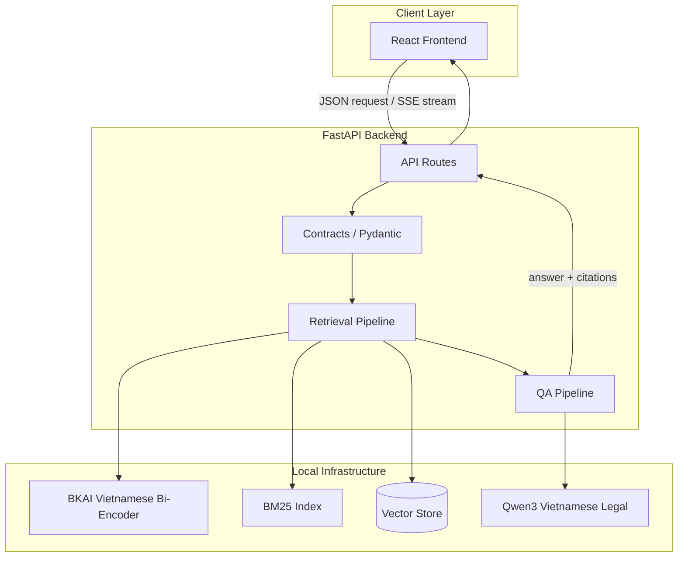
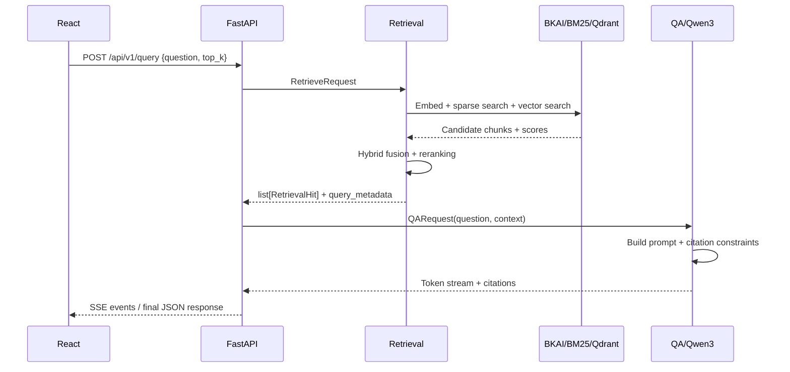

# Thiết kế hệ thống LegalIR & LegalQA

## 1. Phạm vi

Hệ thống gồm hai pipeline độc lập nhưng liên kết bằng các contract chuẩn:

- Retrieval Pipeline: biến câu hỏi thành tập context pháp luật có điểm liên quan.
- QA Pipeline: dùng câu hỏi và context để sinh câu trả lời có citation.

Frontend React chỉ giao tiếp với FastAPI. Model được chạy local, không phụ thuộc API LLM bên ngoài.

## 2. Kiến trúc tổng thể



## 3. Data Flow



## 4. Retrieval Pipeline

### 4.1 Ingestion và indexing

1. Đọc dữ liệu pháp luật từ `data/raw/`.
2. Làm sạch encoding, loại bỏ nội dung thừa và chuẩn hóa metadata.
3. Nhận diện cấu trúc văn bản: luật, chương, mục, điều, khoản, điểm.
4. Chunk theo ranh giới pháp lý, hạn chế cắt giữa các khoản liên quan.
5. Dùng `bkai-foundation-models/vietnamese-bi-encoder` tạo vector cho từng chunk.
6. Lưu vector, text và metadata vào vector store; tạo BM25 index song song.

### 4.2 Online retrieval

Với mỗi query:

1. Chuẩn hóa câu hỏi.
2. BKAI encode query để dense search.
3. BM25 tìm các kết quả khớp thuật ngữ pháp lý.
4. Hybrid fusion kết hợp sparse score và dense score.
5. Rerank, lọc theo threshold và giới hạn `top_k`.
6. Trả về danh sách `RetrievalHit` dùng chung từ `src/udsc2026/contracts/retrieval.py`, gồm `chunk_id`, `text`, `score`, `source`, `article`, `clause` và metadata cần cho QA/rerank.

Retrieval không sinh câu trả lời và không phụ thuộc Qwen3. Điều này cho phép benchmark LegalIR độc lập.

## 5. QA Pipeline

1. Nhận `question` và danh sách context từ Retrieval Pipeline.
2. Sắp xếp context theo độ liên quan và loại bỏ context trùng lặp.
3. Nạp system prompt/version từ `prompts/`.
4. Tạo prompt yêu cầu Qwen3 chỉ sử dụng context được cung cấp.
5. Gọi local model `thangvip/qwen3-1.7b-vietnamese-legal-grpo-phase-2`.
6. Stream token qua FastAPI bằng SSE.
7. Sinh citation từ metadata chunk được sử dụng.
8. Trả về JSON cuối cùng gồm `answer`, `citations`, `retrieval_metadata`.

QA không tự truy cập database. Mọi context phải đi qua `RetrievalHit` từ contract chung, giúp tách biệt trách nhiệm và dễ kiểm thử.

## 6. Contracts chính

```text
RetrieveRequest  = question, top_k, filters?
RetrievalResult  = chunks: list[RetrievalHit], query_metadata
RetrievalHit     = chunk_id, doc_id, text, score?, source?, law_name?, article?, clause?, metadata, dense_score?, sparse_score?, hybrid_score?, rerank_score?, final_score?, rank?
QARequest        = question, context[], prompt_version, rag_template
QAResponse       = answer, citations[], usage, latency
```

`RetrievalHit` được định nghĩa duy nhất tại `src/udsc2026/contracts/retrieval.py` và mọi module Dense Retrieval, BM25, Hybrid Search, QA, Reranker, Evaluation, Logging phải import schema này thay vì tự tạo model riêng. Các schema còn lại đặt tại `src/udsc2026/contracts/`. Thay đổi schema phải được review vì đây là biên giao tiếp giữa Retrieval, QA và API.

## 7. Local Model Layout

```text
models/
├── bkai-bi-encoder/  # bkai-foundation-models/vietnamese-bi-encoder
└── qwen3-legal/      # thangvip/qwen3-1.7b-vietnamese-legal-grpo-phase-2
```

Tải model trước khi chạy backend:

```powershell
pip install huggingface_hub
python .\download_models.py
```

Backend chỉ đọc model từ hai thư mục local này theo cấu hình trong `configs/` hoặc `.env`.

## 8. API và streaming

API tối thiểu:

```text
GET  /health
POST /api/v1/query
```

Request mẫu:

```json
{
  "question": "Điều kiện cấp giấy chứng nhận quyền sử dụng đất là gì?",
  "top_k": 5,
  "prompt_version": "legal_qa_v1",
  "rag_template": "default_rag_v1"
}
```

FastAPI có thể trả `text/event-stream` trong quá trình sinh token và một JSON final event chứa citation. React chịu trách nhiệm render token stream, context source và citation link.

## 9. Ranh giới module

```text
ingestion      không gọi LLM
retrieval      không sinh answer
qa             không tự truy cập vector database
infrastructure chỉ chứa adapter model/storage
api            chỉ orchestration, validation và transport
```

Các ranh giới này giúp nhóm phát triển song song, benchmark riêng LegalIR/LegalQA và thay đổi model mà không phá vỡ API.
