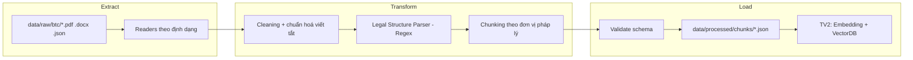

# Data Pipeline chi tiết: ETL cho văn bản pháp luật DSC2026

## Mục tiêu

Tài liệu này mô tả chi tiết kỹ thuật quy trình ETL (Extract – Transform – Load) biến dữ liệu thô do ban tổ chức (BTC) cung cấp thành file JSON chuẩn hoá, sẵn sàng cho module Retrieval (TV2) thực hiện embedding. Tài liệu bổ sung chi tiết triển khai cho `docs/architecture/data_pipeline.md` (đã mô tả luồng tổng thể) và cho nhiệm vụ của TV4 trong `docs/member/tv4.md`.

Nguyên tắc xuyên suốt: **không cắt text mù quáng theo số lượng ký tự**. Mọi bước tách đoạn phải bám theo cấu trúc phân cấp văn bản pháp luật:

```text
Luật (Văn bản) -> Chương -> Mục -> Điều -> Khoản -> Điểm
```



---

## Bước 1: Extract — Đọc dữ liệu thô từ BTC

### Vị trí code

`src/udsc2026/ingestion/readers/`

### Nguồn dữ liệu

BTC có thể cung cấp dữ liệu ở nhiều định dạng: `.pdf`, `.docx`, `.json`, `.jsonl`, `.txt`. Reader phải tự nhận diện định dạng theo phần mở rộng file và dùng đúng thư viện đọc.

| Định dạng | Thư viện gợi ý | Rủi ro cần xử lý |
|---|---|---|
| PDF | `pdfplumber` hoặc `PyMuPDF (fitz)` | Văn bản dạng scan/ảnh cần OCR riêng; PDF có 2 cột dễ đọc sai thứ tự dòng; header/footer lặp lại mỗi trang |
| DOCX | `python-docx` | Bảng biểu lồng trong văn bản luật; heading style không nhất quán giữa các file |
| JSON/JSONL | `json` / `jsonlines` (built-in) | Field name không đồng nhất giữa các file BTC cung cấp qua từng đợt |
| TXT | built-in | Encoding không phải UTF-8 (cần `chardet`/`charset-normalizer` để detect) |

### Interface thống nhất

Bất kể định dạng nguồn, mọi reader phải trả về cùng một object trung gian trước khi sang bước Transform:

```python
from pydantic import BaseModel

class RawDocument(BaseModel):
    doc_id: str          # định danh duy nhất, sinh từ tên file hoặc field id của BTC
    source_path: str      # đường dẫn file gốc trong data/raw/
    title: str | None     # tên văn bản luật nếu đọc được từ metadata/heading đầu tiên
    raw_text: str          # toàn bộ nội dung text thô, giữ nguyên xuống dòng
    file_format: str       # "pdf" | "docx" | "json" | "txt"
    metadata: dict         # thông tin phụ: số trang, ngày ban hành nếu có trong file gốc
```

### Script mẫu (khung xử lý, không rút gọn logic dispatch)

```python
# src/udsc2026/ingestion/readers/dispatch.py
from pathlib import Path
from udsc2026.ingestion.readers.pdf_reader import read_pdf
from udsc2026.ingestion.readers.docx_reader import read_docx
from udsc2026.ingestion.readers.json_reader import read_json
from udsc2026.ingestion.readers.txt_reader import read_txt

READERS = {
    ".pdf": read_pdf,
    ".docx": read_docx,
    ".json": read_json,
    ".jsonl": read_json,
    ".txt": read_txt,
}

def extract_raw_document(file_path: str) -> "RawDocument":
    ext = Path(file_path).suffix.lower()
    reader = READERS.get(ext)
    if reader is None:
        raise ValueError(f"Định dạng không được hỗ trợ: {ext} ({file_path})")
    return reader(file_path)
```

Mỗi hàm `read_*` chỉ chịu trách nhiệm đọc đúng định dạng, không thực hiện cleaning hay parse cấu trúc — việc đó thuộc Bước 2.

### Checklist Extract

- [ ] Đọc được toàn bộ file trong `data/raw/btc/` không lỗi encoding.
- [ ] Mỗi `RawDocument` có `doc_id` duy nhất (kiểm tra trùng trước khi ghi ra).
- [ ] Log lại file đọc lỗi/không parse được vào `data/processed/metadata/extract_errors.json` thay vì làm crash toàn bộ pipeline.

---

## Bước 2: Transform — Bóc tách cấu trúc phân cấp và chuẩn hoá

Vị trí code: `src/udsc2026/ingestion/cleaners/` (làm sạch) và `src/udsc2026/ingestion/legal_structure/` (parser cấu trúc) và `src/udsc2026/ingestion/chunking/` (chunking).

### 2.1 Cleaning trước khi parse

Thực hiện trước khi chạy regex cấu trúc, để regex không bị nhiễu bởi rác text:

- Chuẩn hoá Unicode tiếng Việt về dạng NFC (`unicodedata.normalize("NFC", text)`), vì file PDF/DOCX xuất từ các nguồn khác nhau có thể tổ hợp dấu khác nhau (NFC vs NFD) gây lỗi khi regex so khớp ký tự có dấu.
- Loại bỏ header/footer lặp lại mỗi trang (số trang, tên file, watermark) bằng cách phát hiện dòng lặp lại với tần suất cao bất thường trên nhiều trang.
- Gộp các dòng bị ngắt giữa chừng do xuống dòng PDF cứng (line thuộc cùng 1 câu nhưng bị tách), nhưng **giữ nguyên** xuống dòng ở vị trí bắt đầu `Điều`, `Khoản`, `Điểm` mới.
- Không xoá dấu câu, không xoá số điều khoản — đây là dữ liệu quan trọng nhất cho bước parse cấu trúc.

### 2.2 Xử lý từ viết tắt chuyên ngành

Văn bản pháp luật Việt Nam dùng rất nhiều viết tắt (thường được định nghĩa ngay trong văn bản, ví dụ: "Bộ luật Lao động (sau đây gọi là BLLĐ)"). Cần chuẩn hoá để không ảnh hưởng chất lượng embedding và để LLM hiểu đúng ngữ cảnh khi trích dẫn.

Chiến lược 2 lớp:

1. **Tự động phát hiện định nghĩa viết tắt trong văn bản** bằng regex, build dictionary theo từng `doc_id` (vì cùng 1 từ viết tắt có thể khác nghĩa giữa các văn bản):

```python
import re

# Bắt các mẫu: X (sau đây gọi là Y) / X (sau đây gọi tắt là "Y")
ABBREV_PATTERN = re.compile(
    r"([A-ZĐÂÊÔƠƯ][^()]{3,80}?)\s*\(\s*(?:sau đây (?:gọi là|gọi tắt là|viết tắt là))\s*[\"“]?([^)\"”]{1,20})[\"”]?\s*\)",
    re.UNICODE,
)

def extract_abbreviations(text: str) -> dict[str, str]:
    """Trả về mapping {viết_tắt: cụm_từ_đầy_đủ}."""
    mapping = {}
    for full_form, abbrev in ABBREV_PATTERN.findall(text):
        mapping[abbrev.strip()] = full_form.strip().rstrip(",;.")
    return mapping
```

2. **Dictionary tĩnh** cho các viết tắt phổ biến toàn ngành (không phụ thuộc văn bản cụ thể), lưu ở `src/udsc2026/ingestion/legal_structure/abbreviations.json`, ví dụ:

```json
{
  "BLLĐ": "Bộ luật Lao động",
  "BLDS": "Bộ luật Dân sự",
  "BLHS": "Bộ luật Hình sự",
  "NĐ-CP": "Nghị định của Chính phủ",
  "TT-BTC": "Thông tư của Bộ Tài chính",
  "QĐ": "Quyết định"
}
```

Áp dụng: khi build metadata cho chunk, lưu thêm field `expanded_terms` (mapping viết tắt xuất hiện trong chunk → nghĩa đầy đủ) thay vì thay thế trực tiếp trong `text` gốc — để không làm sai lệch nội dung trích dẫn nguyên văn, nhưng vẫn cung cấp ngữ cảnh cho embedding/LLM qua metadata.

### 2.3 Regex nhận diện cấu trúc phân cấp

Nguyên tắc: parse theo thứ tự từ cấp lớn đến cấp nhỏ, dùng regex neo ở đầu dòng (`re.MULTILINE`) vì văn bản luật Việt Nam có format tiêu đề khá nhất quán ở đầu dòng.

```python
import re

PATTERNS = {
    "chapter": re.compile(r"^Chương\s+([IVXLCDM]+|\d+)[\.\:]?\s*(.*)$", re.MULTILINE | re.UNICODE),
    "section": re.compile(r"^Mục\s+(\d+)[\.\:]?\s*(.*)$", re.MULTILINE | re.UNICODE),
    "article": re.compile(r"^Điều\s+(\d+)[\.\:]?\s*(.*)$", re.MULTILINE | re.UNICODE),
    "clause": re.compile(r"^(\d+)[\.\)]\s+(.*)$", re.MULTILINE | re.UNICODE),
    "point": re.compile(r"^([a-zđ])[\.\)]\s+(.*)$", re.MULTILINE | re.UNICODE),
}
```

Lưu ý khi triển khai thực tế:

- `clause` (Khoản) và số thứ tự liệt kê thông thường trong câu văn rất dễ nhầm lẫn (ví dụ câu văn có "1. ... 2. ..." không phải là Khoản mới). Để giảm false positive, chỉ chấp nhận match `clause`/`point` khi đứng ở đầu dòng **và** dòng trước đó đã nằm trong phạm vi một `Điều` đã được nhận diện — tức là parser cần chạy theo state machine phân cấp (đang ở Điều nào, Khoản nào) chứ không phải regex độc lập từng loại.
- `article` là cấp bắt buộc phải có cho mọi chunk pháp luật; nếu không tìm thấy `Điều` nào trong văn bản, đánh dấu văn bản đó cần review thủ công thay vì chunk mù theo ký tự.
- Tên văn bản luật (`law_name`) thường nằm ở dòng tiêu đề đầu văn bản, không theo pattern cố định — lấy từ `RawDocument.title` (Bước 1) hoặc dòng in hoa đầu tiên nếu `title` rỗng, có thể cần review thủ công cho các case đặc biệt.

### 2.4 Chunking theo đơn vị pháp lý (không cắt mù theo ký tự)

Thuật toán, theo thứ tự ưu tiên:

1. Parse toàn văn bản thành cây phân cấp `Law -> Chapter -> Section? -> Article -> Clause -> Point?` bằng state machine dựa trên `PATTERNS` ở trên.
2. Với mỗi node lá thấp nhất có nội dung (thường là `Clause`, hoặc `Article` nếu Điều đó không chia Khoản):
   - Nếu độ dài text hợp lý (tham chiếu `chunk_size` trong `configs/base.yaml`, mặc định 512 token) → giữ nguyên làm 1 chunk, **không cắt**.
   - Nếu Khoản/Điều quá ngắn (ví dụ chỉ là câu dẫn không có nội dung độc lập) → gộp với node cha liền kề để tránh chunk rỗng nghĩa.
   - Nếu Khoản/Điều quá dài (ví dụ liệt kê nhiều Điểm dài) → chia theo câu (`.`, `;` cuối câu, tránh cắt giữa số liệu) nhưng **mỗi phần vẫn giữ nguyên metadata Điều/Khoản cha**, thêm `chunk_overlap` nhỏ (mặc định 80 token, theo `configs/base.yaml`) giữa các phần liền kề để không mất ngữ cảnh nối câu.
3. Không bao giờ dùng sliding window cắt theo số ký tự cố định trên toàn văn bản mà bỏ qua ranh giới Điều/Khoản — kể cả ở bước 2 (chia câu khi quá dài), điểm cắt vẫn phải nằm trong cùng 1 Khoản, không nhảy sang Khoản khác.

```python
def chunk_legal_article(article_node, chunk_size=512, chunk_overlap=80):
    """article_node: node đã parse, có list các clause con.
    Trả về list[dict] chunk, mỗi chunk giữ metadata cha đầy đủ.
    """
    chunks = []
    for clause in article_node.clauses or [article_node]:  # Điều không có Khoản -> tự làm 1 đơn vị
        text = clause.text.strip()
        if not text:
            continue
        if token_len(text) <= chunk_size:
            chunks.append(build_chunk(clause, text))
        else:
            for part in split_by_sentence_with_overlap(text, chunk_size, chunk_overlap):
                chunks.append(build_chunk(clause, part))
    return chunks
```

### Checklist Transform

- [ ] Mọi chunk sinh ra có đầy đủ `law_name`, `article`; `chapter`/`section`/`clause`/`point` có giá trị khi văn bản gốc có cấp đó.
- [ ] Không có chunk nào bị cắt ngang giữa 2 Khoản khác nhau.
- [ ] Từ viết tắt xuất hiện trong chunk được ánh xạ đầy đủ vào `expanded_terms`.
- [ ] Văn bản không parse được `Điều` nào được đưa vào danh sách review thủ công, không tự động chunk mù.

---

## Bước 3: Load — Định dạng JSON trung gian chuẩn cho module Retrieval (TV2)

Vị trí ghi output: `data/processed/chunks/`. Vị trí báo cáo validation: `data/processed/metadata/`.

### Nguyên tắc Load

- Mỗi chunk là 1 object JSON hoàn chỉnh (khuyến nghị lưu dạng `.jsonl`, mỗi dòng 1 chunk, để TV2 có thể stream đọc và index theo batch mà không cần load toàn bộ file vào RAM).
- Không thay đổi schema field name so với `RetrievalHit` đã thống nhất trong `src/udsc2026/contracts/retrieval.py` — TV2 chỉ cần đọc field, không cần transform thêm.
- `chunk_id` phải duy nhất toàn hệ thống, sinh theo quy ước `<doc_id>_article_<số>_clause_<số>[_point_<ký_tự>]`.

### Mẫu cấu trúc JSON output chuẩn

```json
{
  "chunk_id": "boluatlaodong2019_article_35_clause_1",
  "doc_id": "boluatlaodong2019",
  "text": "Người lao động có quyền đơn phương chấm dứt hợp đồng lao động nhưng phải báo trước cho người sử dụng lao động...",
  "metadata": {
    "law_name": "Bộ luật Lao động 2019",
    "chapter": "Chương III",
    "section": null,
    "article": "Điều 35",
    "clause": "Khoản 1",
    "point": null,
    "effective_date": "2021-01-01",
    "source": "data/raw/btc/bo_luat_lao_dong_2019.pdf",
    "expanded_terms": {
      "BLLĐ": "Bộ luật Lao động"
    },
    "char_count": 187,
    "token_count": 96
  }
}
```

Giải thích field:

| Field | Bắt buộc | Mô tả |
|---|---|---|
| `chunk_id` | ✅ | Định danh duy nhất, dùng làm ID trong VectorDB |
| `doc_id` | ✅ | Định danh văn bản gốc, dùng để trace ngược toàn văn bản |
| `text` | ✅ | Nội dung chunk, nguyên văn (không rút gọn, không dịch từ viết tắt) — đây là phần được embedding |
| `metadata.law_name` | ✅ | Tên văn bản luật, hiển thị khi trích dẫn cho người dùng |
| `metadata.chapter` | Tuỳ văn bản | Chương chứa chunk, `null` nếu văn bản không chia chương |
| `metadata.section` | Tuỳ văn bản | Mục, `null` nếu không có |
| `metadata.article` | ✅ | Điều — bắt buộc với mọi chunk pháp luật |
| `metadata.clause` | Tuỳ văn bản | Khoản, `null` nếu Điều không chia khoản |
| `metadata.point` | Tuỳ văn bản | Điểm, `null` nếu không có |
| `metadata.effective_date` | Nếu có trong nguồn | Ngày hiệu lực, phục vụ lọc văn bản còn hiệu lực |
| `metadata.source` | ✅ | Đường dẫn file gốc trong `data/raw/`, phục vụ audit |
| `metadata.expanded_terms` | Tuỳ chunk | Mapping viết tắt → nghĩa đầy đủ xuất hiện trong chunk |
| `metadata.char_count`/`token_count` | Khuyến nghị | Phục vụ thống kê/validation, không dùng để quyết định lại ranh giới chunk |

### Validation trước khi bàn giao cho TV2

Ghi report vào `data/processed/metadata/validation_report.json`:

- [ ] Mọi dòng `.jsonl` parse JSON hợp lệ.
- [ ] Không `chunk_id` trùng lặp trong toàn bộ dataset.
- [ ] `text` không rỗng, không mất dấu tiếng Việt (kiểm tra tỉ lệ ký tự có dấu hợp lý so với văn bản gốc).
- [ ] `metadata.article` không rỗng với mọi chunk (trừ chunk đã gắn cờ review thủ công).
- [ ] Ghi tổng số document, tổng số chunk, số chunk cần review thủ công vào report.

### Bàn giao

- `data/processed/documents/`: văn bản đã làm sạch, giữ cấu trúc phân cấp đầy đủ (dùng để audit/trace lại).
- `data/processed/chunks/`: file `.jsonl` theo đúng schema ở trên — **đây là input duy nhất TV2 cần đọc để embedding**.
- `data/processed/metadata/`: `validation_report.json`, `extract_errors.json`, danh sách chunk cần review thủ công.

## Liên quan

- Luồng tổng thể (sơ đồ, format QA/instruction): xem `docs/architecture/data_pipeline.md`.
- Nhiệm vụ và Definition of Done của TV4: xem `docs/member/tv4.md`.
- Schema `RetrievalHit` dùng chung toàn hệ thống: xem `src/udsc2026/contracts/retrieval.py`.
- Cấu hình `chunk_size`/`chunk_overlap` mặc định: xem `configs/base.yaml`.
